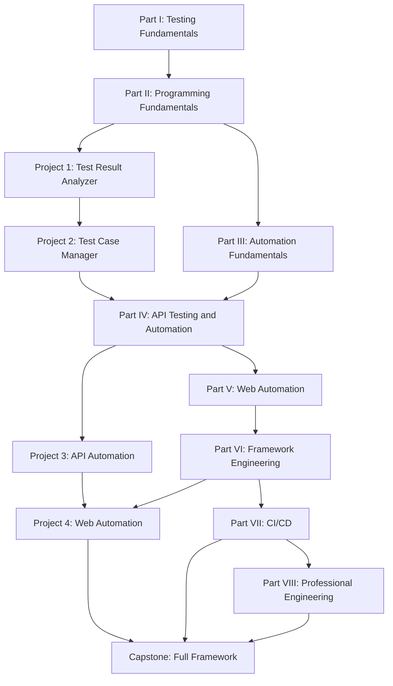
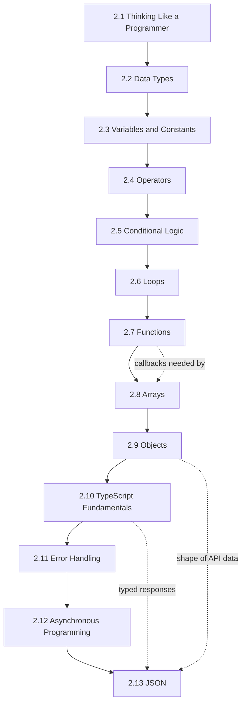
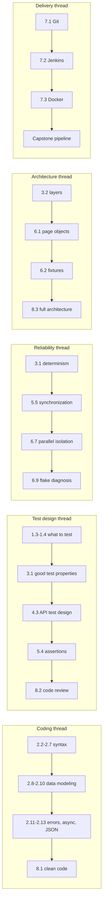

# 03 — Learning Progression and Dependency Map

[← Back to Table of Contents](../README.md)

---

## 1. Why order matters more than content

Beginners rarely fail automation courses because a topic was too hard. They fail because a topic arrived before its foundation. A learner who meets `await page.click()` before understanding what a Promise is will memorize the keyword and never diagnose a race condition. A learner who meets Page Objects before writing raw Playwright scripts will copy a class structure without understanding what problem it solves.

This course therefore treats sequence as a design constraint. Every ordering rule below is enforced by the chapter numbering, restated in each chapter's **Prerequisite Knowledge** section, and reflected in the [weekly schedule](06-weekly-schedule.md).

---

## 2. Difficulty markers

| Marker | Meaning | Learner expectation |
|---|---|---|
| 🟢 **Beginner** | Introduces a concept that depends on at most the immediately preceding chapters. Syntax is small; the ideas are new. | Expect to succeed with effort. Struggling here means slow down, not push on. |
| 🟡 **Intermediate** | Combines several earlier concepts, or requires holding two ideas at once (e.g. async + arrays, locators + assertions). | Expect to need the exercises. Reading alone will not be enough. |
| 🔴 **Advanced** | Requires *design judgment*: there are several defensible answers and the skill is choosing and defending one. | Expect ambiguity by design. Advanced chapters are graded on reasoning, not output only. |

An important consequence: 🔴 does not mean "harder syntax". Chapter 6.4 (Test Data Management) contains simpler code than Chapter 2.12 (Asynchronous Programming) but is marked 🔴 because the hard part is deciding what data strategy a team should adopt.

---

## 3. Mandatory ordering rules

These are the non-negotiable constraints from the course design. Instructors may reorder within a part, but never across these edges.

| Rule | Reason |
|---|---|
| **Data types before variables** | A variable is a named container for a value of some type. Teaching the container before the contents makes types feel like bureaucratic decoration rather than the reason the container has a shape. |
| **Variables before operators** | Operators combine values; learners need somewhere to put a value and a name to refer to it before combining anything. |
| **Conditions before loops** | Every useful loop contains a decision (when to stop, what to skip). Loops without conditions are just repetition; loops with conditions are logic. |
| **Functions before advanced array methods** | `filter`, `map`, and `reduce` take functions as arguments. A learner who does not understand parameters and return values will experience callbacks as magic syntax. |
| **Arrays and objects before API automation** | An API response *is* nested objects and arrays. Without them, response assertions are pattern-matched, not understood. |
| **Async/await before Playwright** | Nearly every Playwright call returns a Promise. A missing `await` is the single most common beginner defect, and it is unteachable after the fact. |
| **HTTP fundamentals before API automation** | `request.post()` is meaningless until method, headers, body, and status codes are meaningful. |
| **API testing before advanced Web automation** | APIs give fast, deterministic feedback with no rendering, no timing, and no locators. Learners build assertion and test-design skills in the simplest environment that still has real consequences. |
| **Basic Playwright before Page Objects** | Page Objects solve duplication and brittleness. Learners must first *feel* that pain in raw scripts, or abstraction becomes cargo cult. |
| **Page Objects before framework architecture** | Architecture is the composition of abstractions. You cannot compose an abstraction you have never built. |
| **Git before Jenkins** | A pipeline's first step is a checkout. Without branches and commits, CI is unexplainable. |
| **Basic automation before CI/CD optimization** | Parallelism, sharding, and retries are optimizations of something that must already work and be trusted. |

---

## 4. Course-level dependency map

---

## 5. Part II chapter dependency chain

Part II is where ordering matters most, because every later chapter builds on it directly.

Solid arrows are hard prerequisites. Dotted arrows mark places where the earlier chapter is the *reason* the later chapter is comprehensible.

---

## 6. Skill-thread view

Five threads run the length of the course. Each thread is picked up repeatedly rather than taught once and abandoned.

When a learner asks "why are we doing assertions again in Chapter 5.4 when we did them in 4.3?", the answer is that the thread deepens: 4.3 taught *what* to assert about data, 5.4 teaches *how to assert without creating a race condition*.

---

## 7. Recommended learning progression (learner-facing)

### Stage 1 — Weeks 1-2: Become a tester who thinks in systems

Read Part I. Do not install anything beyond the tooling in Chapter 2.1. The goal is vocabulary and judgment: what testing is for, what automation buys and costs, and where tests belong.

**Gate to next stage:** you can classify 20 manual test cases into automate-now / automate-later / keep-manual with reasons.

### Stage 2 — Weeks 3-10: Become someone who can program

Work through Part II in strict order. This is the longest stage and the one learners most want to skip. Do every exercise by typing it, not reading it. Build Project 1 after Chapter 2.8 and Project 2 after Chapter 2.13.

**Gate to next stage:** without help, you can write a function that takes an array of test-result objects and returns pass-rate statistics, using `filter` and `reduce`, with typed parameters and a typed return value.

### Stage 3 — Week 11: Learn what makes a test trustworthy

Part III is short and contains almost no code. Its value is that it gives you language for the rest of the course: independence, isolation, determinism, Arrange-Act-Assert, and the layered architecture you will build.

**Gate to next stage:** you can look at a test and name which reliability property it violates.

### Stage 4 — Weeks 12-16: Automate the easy interface first

Part IV. HTTP, REST, API test design, then Playwright API automation from a single GET up to a typed reusable client running against multiple environments. Finish with Project 3.

**Gate to next stage:** your Project 3 suite passes twice in a row, in any order, against a freshly reset environment, with no hardcoded IDs.

### Stage 5 — Weeks 17-19: Open the browser

Part V. Fundamentals, locators, actions, assertions, synchronization. Write ugly, duplicated, script-style tests on purpose. Feel the duplication.

**Gate to next stage:** you can automate login → search → add to cart with zero hard waits.

### Stage 6 — Weeks 20-25: Build a framework, not a folder of scripts

Part VI, plus Project 4. Refactor your ugly scripts into page objects, then fixtures, then reusable auth, then data factories, then configuration, then parallel execution — in that order, feeling the specific problem each one solves.

**Gate to next stage:** your suite runs fully parallel across three browsers, and a single failing test produces a trace you can read.

### Stage 7 — Weeks 26-27: Make it run without you

Part VII. Git workflow, Jenkins pipeline, Docker image.

**Gate to next stage:** someone else can clone your repo and get a report by pressing one button in Jenkins.

### Stage 8 — Weeks 28-32: Become an engineer

Part VIII and the capstone. Clean code, code review, architecture defense.

**Final gate:** the [competency checklist](02-objectives-and-outcomes.md#3-final-competency-checklist), fully ticked, honestly.

---

## 8. If you are behind

Falling behind is normal and is not a reason to skip forward. Triage in this order:

1. **Never skip Part II.** Extend the schedule instead. Everything downstream degrades into copying.
2. **You may compress Part I** to a single week if you are an experienced manual tester.
3. **You may defer Part VI chapters 6.6 (cross-browser) and 6.7 (parallelism)** until after the capstone's first version works.
4. **You may reduce Part VII to Git plus one Jenkins pipeline**, deferring Docker, if time runs out — but note that Docker appears in the capstone rubric.
5. **Do not defer 5.5 or 6.9** (synchronization and flake diagnosis). A suite nobody trusts is worse than no suite.

---

## 9. If you are ahead

- Do the **Bonus challenges** in each project brief rather than starting the next part early. Depth compounds; breadth without depth does not.
- Take an existing chapter's assignment and **rewrite it with stricter constraints**: no `any`, no `let`, functions under 10 lines.
- **Review a peer's code** using the checklist in Chapter 8.2 before you have formally reached Part VIII.
