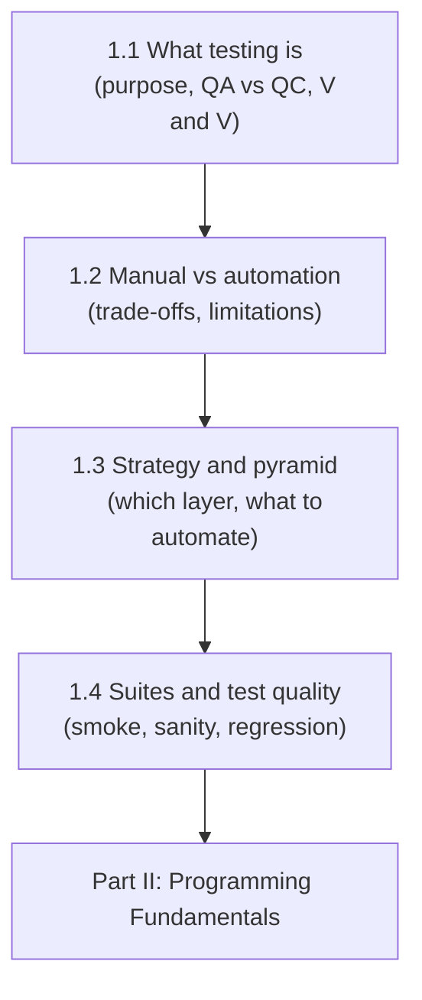

# Part I — Software Testing Fundamentals

[← Back to Table of Contents](../README.md)

**Level:** 🟢 Beginner · **Chapters:** 4 · **Suggested pace:** Weeks 1-2 (4 sessions)

---

## Why this part exists

You could learn Playwright without any of this. Plenty of people have. They become the engineer who automates 400 test cases nobody asked for, cannot explain why the suite takes two hours, and is surprised when the team stops trusting it.

Automation is not a technology problem, it is a decision problem: **what to test, at which layer, how often, and at what maintenance cost.** Part I gives you the vocabulary and judgment to make those decisions before you have the power to implement them badly at scale.

There is almost no code in this part. That is deliberate. Everything here is about the questions you will be asked in every design discussion for the rest of your career: *Should this be automated? Where does it belong? What does it prove? What does it cost us every week from now on?*

---

## Module learning objectives

By the end of Part I you will be able to:

1. **Explain** the purpose of software testing to a technical and a non-technical audience without promising defect-free software.
2. **Distinguish** QA from QC, and verification from validation, using concrete examples from a real feature.
3. **Compare** manual and automated testing on cost, speed, coverage type, and reliability, and identify what each does better.
4. **Analyze** a feature set and place its tests at the appropriate layer of the test pyramid.
5. **Decide** whether a given test case should be automated now, automated later, or kept manual, and defend the decision.
6. **Differentiate** smoke, sanity, and regression suites by purpose, scope, trigger, and runtime budget.
7. **Evaluate** the quality of a written test case against clarity, atomicity, determinism, and verifiability.
8. **Justify** the claim that automation code is production code and must be engineered accordingly.

---

## Chapters in this part

| # | Chapter | Level | Core question |
|---|---|---|---|
| 1.1 | [What Is Software Testing?](01-what-is-software-testing.md) | 🟢 | What are we actually doing, and what can testing never prove? |
| 1.2 | [Manual Testing vs Test Automation](02-manual-vs-automation-testing.md) | 🟢 | What does each approach genuinely buy us, and what does automation cost forever? |
| 1.3 | [Test Strategy and the Test Pyramid](03-test-strategy-and-the-test-pyramid.md) | 🟢 | Where should a given check live so it is fast, stable, and cheap? |
| 1.4 | [Regression, Smoke, Sanity, and Test Case Quality](04-regression-smoke-sanity-and-test-quality.md) | 🟢 | Which suite runs when, and what makes an individual test case good? |

---

## How the chapters connect

Chapter 1.1 establishes what testing can and cannot achieve. Chapter 1.2 uses that to explain why automation is a *trade*, not an upgrade. Chapter 1.3 turns the trade into a placement decision. Chapter 1.4 narrows from suite-level strategy to the quality of a single test case — which is exactly the granularity you will start coding at in Part IV.

---

## Prerequisite knowledge for this part

None beyond curiosity. No programming, no tooling, no testing experience is required.

If you are an experienced manual tester, you can compress this part into a single week by reading the chapters and going straight to the assignments, which are where the automation-specific judgment lives.

---

## What you will produce

| Chapter | Artifact |
|---|---|
| 1.1 | A one-page testing charter for a sample feature: what you would verify and what you would explicitly not claim |
| 1.2 | A cost-benefit analysis of automating a supplied regression suite, with a recommendation |
| 1.3 | A layered test plan for a checkout feature, placing each check at unit, API, or UI level with justification |
| 1.4 | A smoke/sanity/regression suite design with runtime budgets, plus a rewrite of five poorly written test cases |

Nothing here is throwaway. The layered test plan from 1.3 becomes the blueprint you implement across Projects 3 and 4, and the suite design from 1.4 determines which tests your Jenkins pipeline runs on every commit in Part VII.

---

## Time budget

| Activity | Hours |
|---|---|
| Sessions (4 × 90 min) | 6.0 |
| Reading | 2.0 |
| Exercises | 2.0 |
| Assignments | 3.0 |
| Quizzes | 1.0 |
| **Total** | **~14** |

---

## Common misconceptions this part corrects

| Misconception | Reality |
|---|---|
| "Testing proves the software works." | Testing can only reveal the presence of defects, never their absence. |
| "QA is the last gate before release." | QA is a whole-lifecycle discipline; a gate at the end is the most expensive place to find anything. |
| "Automation replaces manual testing." | Automation replaces *repetition*. It cannot replace exploration, intuition, or judgment about whether something feels wrong. |
| "If it can be automated, it should be." | Automation has a permanent maintenance cost. A test that changes every sprint may cost more than it saves. |
| "More automated tests is better." | 40 flaky tests are worth less than 10 trustworthy ones, because an untrusted suite gets ignored. |
| "UI automation is the real automation." | The UI is the slowest, most brittle, and most expensive layer. Good engineers push checks downward. |
| "Automation is a tool skill." | Automation is software engineering. Everything from Part VIII applies to your test code. |

---

## What comes next

Part II teaches you to program. It is the longest and most demanding part of the course, and the one that determines whether you become an automation engineer or a script copier.

Before you move on, confirm the gate: **given 20 manual test cases, you can classify each as automate-now, automate-later, or keep-manual, and defend every classification.**

→ [Instructor Notes for Part I](instructor-notes.md)
→ [Chapter 1.1 — What Is Software Testing?](01-what-is-software-testing.md)
