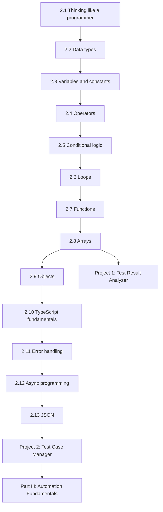

# Part II — Programming Fundamentals

[← Back to Table of Contents](../README.md)

**Level:** 🟢 Beginner → 🟡 Intermediate · **Chapters:** 13 · **Suggested pace:** Weeks 3-10 (14 sessions)

---

## Why this part exists

This is the part learners want to skip and the part that decides the outcome of the course.

Automation frameworks are software. A Playwright test is a TypeScript program that happens to make assertions about another program. If you cannot read a function signature, reason about an array of objects, or explain what `await` does, you will be able to *copy* automation code and unable to *own* it. The difference shows up the first time a test fails for a reason nobody has blogged about.

So Part II teaches programming properly, from zero — and it teaches it with QA data throughout. You will not learn arrays with `[1, 2, 3]`. You will learn them with:

```ts
const testResults = [
  { name: "Login with valid credentials", status: "passed", durationMs: 1240 },
  { name: "Checkout with expired card", status: "failed", durationMs: 3180 },
];
```

Every concept is introduced twice: once as a language feature, once as a tool you will reach for in a real suite.

---

## Module learning objectives

By the end of Part II you will be able to:

1. **Decompose** a problem into input, process, and output, and express the process as pseudocode or a flowchart before coding.
2. **Select** an appropriate data type for any value and **explain** the consequences of choosing wrongly.
3. **Declare** variables and constants with correct annotations, and **explain** when type inference suffices.
4. **Predict** the result of expressions combining arithmetic, comparison, and logical operators, including `===` vs `==`.
5. **Implement** branching and looping logic, and **choose** the appropriate construct for a given task.
6. **Write** typed functions with optional and default parameters, and **explain** scope and purity.
7. **Transform** arrays of QA data using `filter`, `map`, `find`, `some`, `every`, `sort`, and `reduce`.
8. **Model** QA domain entities as objects, arrays of objects, interfaces, and type aliases.
9. **Apply** TypeScript's type system: unions, optional properties, enums, narrowing, and basic generics.
10. **Handle** errors with `try`/`catch`/`throw` and custom error types, and **distinguish** exceptions from assertion failures.
11. **Explain** asynchronous execution, **use** `async`/`await` correctly, and **choose** between sequential and concurrent execution.
12. **Read and write** nested JSON and **convert** between JSON text and typed TypeScript objects.

---

## Chapters in this part

| # | Chapter | Level | What it unlocks |
|---|---|---|---|
| 2.1 | [Thinking Like a Programmer](01-thinking-like-a-programmer.md) | 🟢 | The problem-decomposition habit every later chapter assumes |
| 2.2 | [Data Types](02-data-types.md) | 🟢 | Knowing what a value *is* before naming it |
| 2.3 | [Variables and Constants](03-variables-and-constants.md) | 🟢 | Storing and naming values; `const` by default |
| 2.4 | [Operators](04-operators.md) | 🟢 | Combining and comparing values; the basis of every assertion |
| 2.5 | [Conditional Logic](05-conditional-logic.md) | 🟢 | Decisions: the core of pass/fail reasoning |
| 2.6 | [Loops](06-loops.md) | 🟢 | Repetition over collections of test data |
| 2.7 | [Functions](07-functions.md) | 🟢 | Reuse, and the prerequisite for callbacks |
| 2.8 | [Arrays](08-arrays.md) | 🟡 | Working with sets of results, users, products |
| 2.9 | [Objects](09-objects.md) | 🟡 | Modeling entities; the shape of every API response |
| 2.10 | [TypeScript Fundamentals](10-typescript-fundamentals.md) | 🟡 | Interfaces, unions, enums, narrowing, generics |
| 2.11 | [Error Handling](11-error-handling.md) | 🟡 | Failing usefully instead of failing mysteriously |
| 2.12 | [Asynchronous Programming](12-asynchronous-programming.md) | 🟡 | The single most important prerequisite for Playwright |
| 2.13 | [JSON](13-json.md) | 🟢 | The wire format of every API you will test |

---

## How the chapters connect



Two ordering choices are worth calling out, because they differ from most tutorials:

**Data types before variables (2.2 before 2.3).** A variable is a named container whose shape is determined by what it holds. Teaching containers first makes types feel like paperwork. Teaching values first makes annotations feel like a natural description of reality.

**Functions before advanced array methods (2.7 before 2.8).** `filter`, `map`, and `reduce` take functions as arguments. Without a solid grasp of parameters and return values, callbacks are experienced as incantation rather than composition — and learners never recover the intuition.

---

## Prerequisite knowledge for this part

| Required | Where it came from |
|---|---|
| Testing vocabulary: test case, test suite, pass/fail, regression | [Part I](../part-1-testing-fundamentals/00-module-overview.md) |
| A working Node.js, npm, VS Code, and Git installation | [Course Overview §7](../00-course-overview/01-overview.md#7-environment-setup) |
| Willingness to type every example by hand | Non-negotiable |

No programming experience is assumed anywhere in this part.

---

## How to study this part

This is the one part of the course with a prescribed study method, because the failure mode is well known and preventable.

1. **Type every example.** Not copy-paste. Typing produces the syntax errors that teach you to read compiler messages, which is a skill you need in Part V far more than you need a working example now.
2. **Predict before running.** Write down what you expect the output to be, then run it. The gap between prediction and reality is the actual lesson.
3. **Do all three exercise tiers.** Easy builds syntax fluency, Medium builds composition, Challenge builds the judgment the assignments assume.
4. **Do not read ahead when stuck.** Chapters in this part are strictly cumulative; a gap compounds.
5. **Use AI for explanations only.** This is the most restricted stage in the [AI policy](../00-course-overview/05-ai-policy.md#5-guidance-by-course-stage). Asking for solution code here trades your competence for a completed exercise.

**Expected weekly effort:** 8-10 hours. If you are spending less than 6, you are reading rather than practicing.

---

## What you will produce

| Chapter | Artifact |
|---|---|
| 2.1 | Pseudocode and a flowchart for a login-validation routine |
| 2.2-2.4 | A typed "test environment config" file and an expression-prediction worksheet |
| 2.5 | A test-result classifier (pass / fail / skipped / blocked) using conditionals |
| 2.6 | A batch result reporter iterating over a suite's results |
| 2.7 | A reusable library of small QA helper functions with typed signatures |
| 2.8 | Pass-rate, slowest-test, and failure-filter functions over arrays of results |
| 2.9 | Typed models for test cases, users, and products, with nested data |
| 2.10 | Interfaces, unions, enums, and one generic helper for the same models |
| 2.11 | Validation routines with custom error types and diagnosable messages |
| 2.12 | Sequential vs concurrent result fetching, and a missing-`await` bug hunt |
| 2.13 | A JSON test-data loader that parses, validates, and types its input |
| **Project 1** | [Test Result Analyzer](../projects/project-1-test-result-analyzer.md) — CLI that counts, computes pass rate, and summarizes |
| **Project 2** | [Test Case Management App](../projects/project-2-test-case-management.md) — create, list, search, update, delete, filter, and report |

Project 2's data model is deliberately the same shape you will meet again in Part IV as an API response, and again in the capstone as a data factory output. You are building intuition you will reuse three times.

---

## Time budget

| Activity | Hours |
|---|---|
| Sessions (14 × 90 min) | 21.0 |
| Reading | 10.0 |
| Exercises | 16.0 |
| Chapter assignments | 16.0 |
| Projects 1 and 2 | 14.0 |
| Quizzes and review | 5.0 |
| **Total** | **~82** |

---

## Common misconceptions this part corrects

| Misconception | Reality |
|---|---|
| "I'll learn programming later, once I know Playwright." | Playwright *is* programming. Deferring this makes every later chapter opaque. |
| "TypeScript types are extra work for no benefit." | Types are the cheapest test you will ever write. They catch a whole class of automation defects before the browser opens. |
| "`let` and `const` are interchangeable." | Defaulting to `const` eliminates a category of bugs where shared state mutates unexpectedly — which becomes critical under parallel execution. |
| "`==` is fine." | `==` performs coercion. `"0" == false` is true. In assertions, that is a false pass. |
| "Loops are how you process arrays." | Often true, but `filter`/`map`/`reduce` express *intent*. QA code is read far more than written. |
| "An object and JSON are the same thing." | JSON is text. An object is a runtime value. Confusing them produces the classic "why is my assertion comparing a string to an object" failure. |
| "`async`/`await` is just syntax you sprinkle on Playwright calls." | It is a model of execution. Without it, missing `await` bugs are invisible and unfixable. |
| "If it runs, it's correct." | Code that runs on the happy path and crashes on an empty array is the most common assignment defect in this part. |

---

## Gate before moving on

Do not start Part III until you can do this **without help, from a blank file**:

> Write a function that takes an array of test-result objects and returns an object containing total count, passed count, failed count, pass rate as a percentage, and the names of failed tests — with typed parameters, a typed return value, using `filter` and `reduce`, and handling an empty input array correctly.

If that sentence is intimidating, that is expected right now. If it is still intimidating after Chapter 2.8, re-do the Chapter 2.7 and 2.8 exercises before continuing.

---

## What comes next

Part III steps back from syntax and asks what makes an automated test trustworthy: independence, isolation, determinism, and layered architecture. It is short, contains little code, and gives you the vocabulary that the rest of the course uses constantly.

→ [Instructor Notes for Part II](instructor-notes.md)
→ [Chapter 2.1 — Thinking Like a Programmer](01-thinking-like-a-programmer.md)
