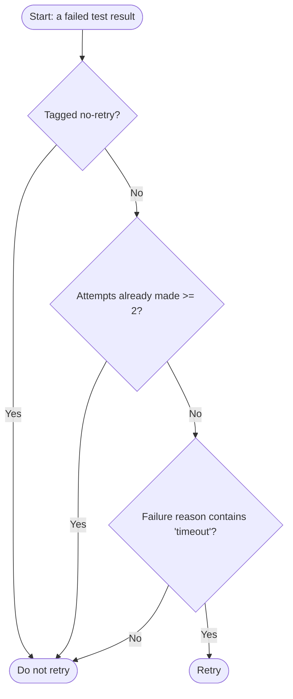

# Chapter 2.1 — Thinking Like a Programmer

🟢 **Beginner** · [Part II Overview](00-module-overview.md) · [Table of Contents](../README.md)

| | |
|---|---|
| **Part** | II — Programming Fundamentals |
| **Estimated time** | 1 session (90 min) + 4 hours independent work |
| **Prerequisite chapters** | [Part I](../part-1-testing-fundamentals/00-module-overview.md) complete |
| **Next chapter** | [2.2 Data Types](02-data-types.md) |

---

## A. Learning Objectives

By the end of this chapter you will be able to:

1. **Decompose** a stated problem into input, process, and output.
2. **Write** pseudocode that expresses a solution before any code exists.
3. **Draw** a flowchart for a process containing decisions and repetition.
4. **Break** a large problem into smaller independently solvable problems.
5. **Trace** an algorithm by hand and **predict** its result for given inputs.
6. **Set up** and verify a working Node.js, TypeScript, and VS Code environment, and run a first program from the terminal.

---

## B. Prerequisite Knowledge

| Required | From |
|---|---|
| Testing vocabulary: test case, suite, pass/fail | [Part I](../part-1-testing-fundamentals/00-module-overview.md) |
| Ability to install software and use a file manager | General computer literacy |

No programming experience assumed. This chapter deliberately contains almost no syntax.

---

## C. Concept Explanation

### C.1 Programming is deciding, not typing

Here is the difference between someone who has been learning to code for two weeks and someone who has been doing it for two years: when given a problem, the beginner opens an editor, and the experienced programmer picks up a pen.

That is not a personality difference. It is the recognition that typing is the easy part. Before any code exists, three questions have to be answered:

1. **What am I given?** (input)
2. **What must I produce?** (output)
3. **What steps turn one into the other?** (process)

Beginners skip to typing because typing feels like progress. Twenty minutes later they are stuck, not because they do not know the syntax, but because they never decided what they were building. They are trying to solve the problem and express the solution simultaneously, in a language they barely speak.

The habit this chapter installs is unglamorous and worth more than any syntax you will learn this month:

> **State the input. State the output. Describe the process in plain language. Then write code.**

Once the process is decided, writing code becomes transcription. And transcription is a skill you will have within a fortnight.

### C.2 Input → Process → Output

Every program, function, and test fits this frame. It is worth practicing on QA problems until it becomes reflexive, because it is also the shape of a test case.

| Problem | Input | Process | Output |
|---|---|---|---|
| Count failed tests | A list of test results | Look at each result; count those with status `failed` | A number |
| Compute pass rate | A list of test results | Count passed; divide by total; convert to percent | A percentage |
| Find the slowest test | A list of test results with durations | Track the longest duration seen so far | One test result |
| Decide whether to retry | One failed result, plus retry rules | Check the failure reason and attempt count against the rules | Yes or no |
| Validate a discount code | A code string, plus the code database | Look it up; check expiry, usage, minimum spend | Valid, or a reason for rejection |

Two observations that pay off later.

**The output is often the hardest part to pin down**, and it is where beginners are vaguest. "Produce a summary" is not an output. "Produce an object containing total, passed, failed, pass rate as a percentage to one decimal place, and the names of failed tests" is an output — and notice that you now know what to build.

**This is the same frame as a test case.** [Chapter 1.4](../part-1-testing-fundamentals/04-regression-smoke-sanity-and-test-quality.md) required preconditions and test data (input), steps (process), and an expected result (output). A test case *is* an input-process-output specification. You already know how to think this way; this chapter just applies it to code.

### C.3 What an algorithm is

An algorithm is a finite sequence of unambiguous steps that solves a problem. Nothing about it requires a computer.

Here is one you already know, expressed properly. **Problem:** given a stack of printed test results, find the slowest test.

```text
1. If the stack is empty, report "no results" and stop.
2. Take the first sheet. Call it the slowest so far.
3. For each remaining sheet:
   a. If this sheet's duration is greater than the slowest so far,
      make this sheet the new slowest so far.
4. Report the slowest so far.
```

Four properties make this an algorithm rather than a vague plan, and each corresponds to a specific way beginner code fails:

| Property | Meaning | The failure when it's missing |
|---|---|---|
| **Finite** | It ends | Infinite loop |
| **Unambiguous** | Each step has exactly one interpretation | Code that does something other than what you meant |
| **Defined inputs** | You know what you are given | Crash on empty input — the most common assignment defect in this part |
| **Defined output** | You know what "done" looks like | Half-finished functions returning `undefined` |

Look at step 1. A beginner writing this algorithm almost always omits it, and their code then crashes on an empty list. The empty case is not an edge case bolted on afterwards; it is part of the problem, and deciding about it belongs in the design.

### C.4 Pseudocode

Pseudocode is a solution written in structured English. It has no syntax rules, cannot fail to compile, and can be reviewed by someone who does not know TypeScript.

The conventions used throughout this book:

```text
SET name TO value              assign a value
IF condition THEN ... END IF   a decision
ELSE                           the alternative branch
FOR EACH item IN collection    repeat over a collection
WHILE condition                repeat while something is true
RETURN value                   produce the result and stop
CALL functionName(arguments)   use another routine
DISPLAY value                  show something to the user
```

A worked example. **Problem:** count how many test results failed.

```text
FUNCTION countFailures(results)
    IF results is empty THEN
        RETURN 0
    END IF

    SET failureCount TO 0

    FOR EACH result IN results
        IF result.status IS "failed" THEN
            SET failureCount TO failureCount + 1
        END IF
    END FOR

    RETURN failureCount
END FUNCTION
```

You can read that, check it, and hand it to a colleague, and none of you needs to know a programming language. When you translate it in [Chapter 2.6](06-loops.md) it will be almost line-for-line.

**The trap to avoid.** Pseudocode that is really just code with worse syntax:

```text
❌ let failureCount: number = 0;
   for (let i = 0; i < results.length; i++) {
       if (results[i].status === "failed") { failureCount++; }
   }
```

That is TypeScript with the semicolons wobbling. It provides no thinking benefit, because the point of pseudocode is to work at the level of *meaning*, where mistakes are cheap and visible. If your pseudocode contains `i++` or curly braces, you are typing rather than deciding.

### C.5 Flowcharts

A flowchart makes branching and repetition visible, which is exactly where beginner logic goes wrong. Four shapes cover almost everything:

| Shape | Means |
|---|---|
| Rounded rectangle | Start or end |
| Rectangle | A process step |
| Diamond | A decision, with labelled outgoing paths |
| Arrow | Flow of control |

Here is "should this failed test be retried?", given three rules: retry if the failure looks like a timeout, do not retry more than twice, and never retry a test tagged `no-retry`.



Drawing this takes two minutes and answers questions the prose version left open. What if a test is tagged `no-retry` *and* timed out? The chart says do not retry, because that check comes first — and now you have decided, deliberately, rather than discovering the behavior later. What if attempts is exactly 2? The chart says stop, because the condition is `>= 2`. Off-by-one decisions like that are invisible in prose and obvious in a diagram.

**When to use which.** Pseudocode is better for sequences and transformations. Flowcharts are better for anything with several interacting decisions, because they force you to resolve precedence. Most real design uses both: a flowchart for the decision logic, pseudocode for the steps inside each branch.

### C.6 Decomposition

Large problems are not solved. They are broken into small problems that are solved, and the breaking is the skill.

**The problem:** "Produce a test run summary report."

Stated like that it is unapproachable, and the beginner response is to open an editor and start typing something. Decompose it instead:

```text
Produce a test run summary report
├── 1. Read the results from a file
│      input:  a file path
│      output: a list of result records
├── 2. Count results by status
│      input:  a list of results
│      output: counts for passed, failed, skipped
├── 3. Compute the pass rate
│      input:  passed count and total count
│      output: a percentage
├── 4. Find the failed test names
│      input:  a list of results
│      output: a list of names
├── 5. Find the slowest tests
│      input:  a list of results, and how many to return
│      output: a shorter list of results
└── 6. Format everything as readable text
       input:  the counts, rate, names, and slowest
       output: a string to print
```

Six problems, each of which you could solve in a few lines. Each has a clear input and output, which means each can be built and checked **independently** — you can verify that step 2 counts correctly without step 1 working, by handing it a list you typed by hand.

Two properties to aim for when decomposing:

**Each piece does one thing.** If a description needs the word "and," consider splitting it. "Count results and compute the pass rate" is two problems.

**Each piece can be checked alone.** This is the property that makes debugging tractable. When the report is wrong, you can test the six pieces separately and find which one lies. Without decomposition you have one large thing that is wrong somewhere.

That second property is also, exactly, the [Chapter 1.4](../part-1-testing-fundamentals/04-regression-smoke-sanity-and-test-quality.md) atomicity criterion applied to code instead of test cases. The same idea keeps reappearing because it is the same idea.

### C.7 Tracing by hand

Tracing — also called desk-checking — means executing your algorithm on paper, one step at a time, recording every value as it changes. It is tedious and it is the fastest way to find a logic error, because it removes the possibility of assuming.

Trace `countFailures` from C.4 with this input:

```text
results = [
  { name: "login",    status: "passed" },
  { name: "checkout", status: "failed" },
  { name: "search",   status: "failed" },
]
```

| Step | Current result | `result.status` | Condition true? | `failureCount` after |
|---|---|---|---|---|
| Before loop | — | — | — | 0 |
| Iteration 1 | login | `passed` | No | 0 |
| Iteration 2 | checkout | `failed` | Yes | 1 |
| Iteration 3 | search | `failed` | Yes | 2 |
| Return | — | — | — | **2** |

Predicted output: `2`. Now trace it with the empty list: step 1 returns `0` immediately, so the output is `0`. Both cases are decided before any code exists.

**The habit that matters most:** trace the awkward inputs, not the comfortable one. Empty list. One item. All items failing. None failing. A duration of zero. Two tests tied for slowest. Those are where the defects live, and the trace table is where you find them for free rather than at 11pm during a debugging session.

### C.8 Environment setup

Now the practical part. You need four things: Node.js, npm, VS Code, and a project folder with TypeScript in it.

**1. Install Node.js.** Get the current LTS release from [nodejs.org](https://nodejs.org). npm comes with it. Verify in a terminal:

```bash
node --version    # expect v22.x.x or newer
npm --version     # expect 10.x.x or newer
```

If either command reports "command not found," Node is not on your PATH — usually fixed by closing and reopening the terminal, and failing that by reinstalling.

**2. Install VS Code** from [code.visualstudio.com](https://code.visualstudio.com), then add two extensions: **ESLint** and **Prettier**. TypeScript support is already built in.

**3. Create the project.** These commands are your workspace for all of Part II:

```bash
mkdir qa-automation-course
cd qa-automation-course
npm init -y
npm install --save-dev typescript tsx @types/node
npx tsc --init
```

What each command did, because copying commands you do not understand is a habit worth breaking on day one:

| Command | What it does |
|---|---|
| `mkdir` / `cd` | Create the project folder and move into it |
| `npm init -y` | Create `package.json`, which records your project's dependencies |
| `npm install --save-dev typescript` | Install the TypeScript compiler, locally to this project |
| `... tsx` | Install a tool that runs `.ts` files directly, without a separate compile step |
| `... @types/node` | Install type definitions for Node's built-in features, so TypeScript understands things like file reading |
| `npx tsc --init` | Create `tsconfig.json`, which configures the compiler |

**4. Configure TypeScript strictly.** Open `tsconfig.json` and make sure these are set:

```json
{
  "compilerOptions": {
    "target": "ES2022",
    "module": "commonjs",
    "strict": true,
    "noUncheckedIndexedAccess": true,
    "outDir": "./dist"
  }
}
```

`"strict": true` is non-negotiable in this course, and it will occasionally annoy you. That annoyance is the compiler catching a defect before you run anything, which is the cheapest test you will ever get. `noUncheckedIndexedAccess` is stricter still: it forces you to acknowledge that `results[5]` might not exist, which prevents an entire category of crash you will otherwise meet in [Chapter 2.8](08-arrays.md).

**5. Write and run your first program.** Create `hello.ts`:

```ts
console.log("Environment works.");
```

Run it:

```bash
npx tsx hello.ts
```

Expected output:

```text
Environment works.
```

If you see that line, everything is installed correctly. If you do not, read Section C.9 rather than starting over.

### C.9 Reading error output without fear

Beginners see red text and stop reading. Error messages are the most useful documentation you will ever receive, and they follow a consistent structure.

```text
hello.ts:1:13 - error TS2304: Cannot find name 'consol'.

1 consol.log("Environment works.");
              ~~~~~~
```

Read it in four parts:

| Part | Meaning |
|---|---|
| `hello.ts:1:13` | File, line 1, column 13 — where to look |
| `error TS2304` | An error code you can search for |
| `Cannot find name 'consol'` | What went wrong, in plain English |
| The `~~~~~~` marks | Exactly which characters are the problem |

The message told you the file, the line, the column, and the misspelled word. There is nothing to fear and nothing to guess.

Three you will meet this week:

| Message | Usually means |
|---|---|
| `Cannot find name 'x'` | Typo, or you used something before declaring it |
| `Type 'string' is not assignable to type 'number'` | You put the wrong kind of value somewhere ([Chapter 2.2](02-data-types.md)) |
| `Object is possibly 'undefined'` | You accessed something that might not exist — `strict` mode protecting you |

**The rule:** read the whole message, out loud if necessary, before changing anything. Most beginner debugging time is spent making random changes to code whose error message already contained the answer. This matters far beyond this chapter — in [Chapter 6.8](../part-6-framework-engineering/08-debugging-playwright-tests.md) you will read Playwright failure output for a living, and the habit either exists by then or it does not.

### C.10 The debugging mindset

When something does not work, the instinct is to change things until it does. That instinct is expensive and it does not scale past trivial programs. The alternative is a loop:

1. **Observe** exactly what happened. Not "it doesn't work" — what specifically appeared, and what did you expect instead?
2. **Hypothesize** one specific cause. "The count is one too high because the loop includes the header row."
3. **Predict** what you would see if the hypothesis were true.
4. **Test** it by changing **one** thing.
5. **Observe** again. If the prediction held, you have found it. If not, the hypothesis was wrong — which is progress, because you have eliminated something.

The discipline is **one change at a time**. Change three things, and if the behavior changes you do not know which one mattered; if it does not, you cannot rule out any of them.

This is not a coding technique. It is the scientific method, and it is the same procedure you will use to diagnose a flaky test in [Chapter 6.9](../part-6-framework-engineering/09-diagnosing-flaky-tests.md) — where "add a wait and see if it goes away" is the equivalent of changing three things and hoping.

---

## D. QA Context

### D.1 A test is input → process → output

The frame from C.2 is not merely analogous to a test's structure. It is the same structure, and recognizing that early makes Part V much less mysterious.

Every automated test you will write has three phases, conventionally called **Arrange-Act-Assert** and formalized in [Chapter 3.1](../part-3-automation-fundamentals/01-principles-of-good-automated-tests.md):

| Test phase | I/P/O equivalent | In practice |
|---|---|---|
| **Arrange** | Input | Create the user, seed the cart, set the state |
| **Act** | Process | Perform the one action under test |
| **Assert** | Output | Compare what happened to what was expected |

So the design skill you are practicing on `countFailures` transfers directly. When you plan a test, you are answering: what state must exist first, what single thing am I doing, and what precisely must be true afterwards. Learners who cannot answer the third question write tests that assert nothing — the failure [Chapter 1.4](../part-1-testing-fundamentals/04-regression-smoke-sanity-and-test-quality.md) called unverifiable, arriving in code form.

### D.2 Pseudocode lets you design a test before knowing the tool

You do not know Playwright yet. You can still design a Playwright test today:

```text
TEST "a customer with a $100 cart sees free shipping"
    ARRANGE
        CALL api.createCustomer()             -> customer
        CALL api.createCart(customer)          -> cart
        CALL api.addItem(cart, "lamp", 2)      -> subtotal is 99.00
        CALL api.addItem(cart, "clips", 1)     -> subtotal is 100.00
    ACT
        NAVIGATE to the cart page as customer
    ASSERT
        The shipping line displays exactly "FREE"
        The order total displays "$100.00"
    CLEANUP
        CALL api.deleteCart(cart)
```

That is a complete test design. Nothing about it depends on knowing Playwright's API, and when you learn that API in [Part V](../part-5-web-automation-playwright/00-module-overview.md) this becomes transcription — which is the same claim made in C.1, now applied to something you cannot yet write.

This is also why [Project 3](../projects/project-3-api-automation.md) requires a test design document *before* any code, and why the rubric weights design at 25%. Designing tests and implementing tests are separate skills, and the first one is worth more.

### D.3 Tracing by hand is what reading a trace file is

The trace table in C.7 has a direct professional descendant. When a Playwright test fails in CI, you open the trace viewer and step through what happened: at this action the page looked like this, this request went out, this element was found, this assertion compared these two values.

That is a trace table with screenshots. The skill — walking a process step by step and recording the actual state at each point, rather than assuming — is identical. Learners who do the tracing exercises in this chapter find [Chapter 6.8](../part-6-framework-engineering/08-debugging-playwright-tests.md) natural. Learners who skip them tend to look at a trace viewer and see a confusing timeline.

### D.4 Decomposition is framework architecture in miniature

The six-piece breakdown in C.6 is a small version of the layering you will build in [Part VI](../part-6-framework-engineering/00-module-overview.md). Look at the resemblance:

| C.6 decomposition | Framework equivalent |
|---|---|
| "Read results from a file" | The data/fixture layer |
| "Count by status" / "compute pass rate" | Pure helper functions in the support layer |
| "Format as readable text" | The reporting layer |
| Each piece independently checkable | Layers with one-way dependencies |

The reason [Project 1](../projects/project-1-test-result-analyzer.md) insists on pure functions and separation of computation from presentation is not stylistic. It is that the habit you build on a 200-line CLI program is the habit you will need on a 5,000-line framework, and it is much cheaper to learn now.

---

## E. Code Examples

The four examples build from "does my environment work" to "this is what a test looks like." Type them; do not copy them.

### E.1 Very simple — printing, and running a file

```ts
// hello.ts
console.log("Environment works.");
console.log("Node version:", process.version);
```

```bash
npx tsx hello.ts
```

```text
Environment works.
Node version: v22.14.0
```

Two things happened. `console.log` printed text to the terminal, and passing several arguments printed them separated by spaces. `process.version` is a value Node provides about itself — you did not define it, which is what `@types/node` was for.

### E.2 Practical — a fixed test summary

No logic yet, just output shaped the way you want it. This is a legitimate first step: decide what the output looks like before computing it.

```ts
// summary-fixed.ts
console.log("TEST RUN SUMMARY");
console.log("================");
console.log("Total:    10");
console.log("Passed:    8");
console.log("Failed:    2");
console.log("Pass rate: 80.0%");
```

```text
TEST RUN SUMMARY
================
Total:    10
Passed:    8
Failed:    2
Pass rate: 80.0%
```

Why bother? Because you have now defined the **output** precisely, which was the hard part in C.2. Every remaining step is producing those numbers instead of typing them, and you will know you are finished when the real version prints this shape.

### E.3 QA-oriented — pseudocode, then its translation

The pseudocode from C.4, with the trace from C.7 as the expected result:

```text
FUNCTION countFailures(results)
    IF results is empty THEN RETURN 0
    SET failureCount TO 0
    FOR EACH result IN results
        IF result.status IS "failed" THEN
            SET failureCount TO failureCount + 1
        END IF
    END FOR
    RETURN failureCount
END FUNCTION
```

Its literal translation. You are not expected to be able to write this yet — read it and notice how closely it tracks the pseudocode:

```ts
// count-failures.ts
const results = [
  { name: "login with valid credentials", status: "passed" },
  { name: "checkout with expired card", status: "failed" },
  { name: "search returns results", status: "failed" },
];

let failureCount = 0;

for (const result of results) {
  if (result.status === "failed") {
    failureCount = failureCount + 1;
  }
}

console.log("Failures:", failureCount);
```

```text
Failures: 2
```

Line by line against the pseudocode:

| Pseudocode | Code |
|---|---|
| `SET failureCount TO 0` | `let failureCount = 0;` |
| `FOR EACH result IN results` | `for (const result of results) {` |
| `IF result.status IS "failed"` | `if (result.status === "failed") {` |
| `SET failureCount TO failureCount + 1` | `failureCount = failureCount + 1;` |
| `RETURN` / report | `console.log(...)` |

The mapping is one-to-one. That is the entire argument for pseudocode: the thinking happened in English, and the code is a translation. Everything unfamiliar here — `const`, `let`, `===`, `for...of` — is the subject of Chapters 2.3 through 2.6, and you will meet each properly.

Note the one thing missing: the empty-list check. In this code it is unnecessary, because the loop simply does not execute over an empty array and `failureCount` stays 0. That is a *language fact* you could only know by knowing the language — which is why the pseudocode included the check explicitly. Being explicit in design and discovering the language does it for you is the right order; assuming it and being wrong is how the C.3 "defined inputs" property gets violated.

### E.4 Automation-oriented — the shape of a test

A preview, in pseudocode, of what you will write in [Part V](../part-5-web-automation-playwright/00-module-overview.md). Read it as a design document, not as code.

```text
TEST "searching for a known product shows it in the results"

    ARRANGE
        SET searchTerm TO "Aeron Desk Lamp"
        CALL api.ensureProductExists(searchTerm)
        NAVIGATE to the home page

    ACT
        TYPE searchTerm into the search field
        SUBMIT the search

    ASSERT
        The results list contains at least one item
        The first result's title IS searchTerm
        The results count message displays "1 result"

    CLEANUP
        none required — this test created no data it must remove
```

Three things worth noticing now, because each becomes a rule later:

**Arrange uses the API, not the UI.** The test's subject is search, so getting the product to exist should not involve clicking through an admin screen. This is the requirement in [Project 4](../projects/project-4-web-automation.md) that data setup goes through API clients.

**There is exactly one Act.** One action under test. If this had two, a failure would not tell you which one broke — the atomicity criterion again.

**Assert is specific.** "The first result's title IS searchTerm," not "the results look right." Two engineers would agree on whether this passed.

You cannot implement this today. You can design it today, and that is the point of the chapter.

---

## F. Common Mistakes

### F.1 Writing code before deciding what the output should be

**The mistake:** opening an editor and typing, with only a vague sense of what the program produces.

**Why it happens:** typing feels like progress, and thinking feels like stalling.

**What it costs:** twenty minutes of work followed by a stall, because the missing piece was never a syntax problem. Beginners frequently rewrite the same half-solution three times.

**Instead:** write the output first, literally, as in example E.2. Then work backwards. If you cannot state the output in one specific sentence with values in it, you are not ready to type.

### F.2 Pseudocode that is really just code

**The mistake:** `for (let i = 0; i < results.length; i++)` in something labelled pseudocode.

**Why it happens:** once you know a little syntax it feels more precise, and precision feels better.

**What it costs:** the whole benefit. Pseudocode exists to let you reason at the level of meaning, where errors are cheap. Writing it in near-code means you are debugging syntax while still deciding logic — the two problems you were trying to separate.

**Instead:** if it contains `i++`, braces, or semicolons, rewrite it in English. `FOR EACH result IN results` says what you mean; the C-style loop says how a machine does it.

### F.3 Skipping the trace because the logic "looks right"

**The mistake:** reading your algorithm, judging it correct, and moving on.

**Why it happens:** your algorithm looks right to you because you wrote it — you are checking it against the same mental model that produced it.

**What it costs:** off-by-one errors, comparisons in the wrong direction, the missed empty case. All invisible on inspection and obvious in a trace table.

**Instead:** trace the awkward inputs specifically — empty, one item, all failing, none failing, ties. Five minutes of table-filling beats an hour of debugging, every time.

### F.4 Trying to solve the whole problem at once

**The mistake:** attempting "produce a test run summary report" as one piece of work.

**Why it happens:** the problem was stated as one thing, so it feels like one thing.

**What it costs:** when the output is wrong you cannot tell which part is wrong, so debugging becomes guesswork across the entire program.

**Instead:** decompose as in C.6, with an input and output for each piece, and build them one at a time. Verify piece 2 with hand-typed input before piece 1 exists.

### F.5 Panicking at the first error message

**The mistake:** seeing red text, not reading it, and changing something at random.

**Why it happens:** errors feel like failure, and reading them feels like dwelling on it.

**What it costs:** the answer was usually in the message. Random changes also add new problems on top of the original, which is how a one-line typo becomes an afternoon.

**Instead:** read the whole message — file, line, column, code, explanation, and the `~~~~` marks. Then one hypothesis, one change. This habit is worth more in [Part V](../part-5-web-automation-playwright/00-module-overview.md) than any Playwright knowledge.

### F.6 Installing tools by copying commands blindly

**The mistake:** running the C.8 commands without knowing what any of them did.

**Why it happens:** it works, and understanding takes longer.

**What it costs:** when the environment breaks — and it will — you have no model of what exists, so you cannot diagnose anything. You will also fail to recognize the same tools in [Chapter 7.3](../part-7-cicd/03-docker-for-test-automation.md) when they appear in a Dockerfile.

**Instead:** read the command table in C.8. You do not need deep npm knowledge; you need to know that `package.json` records dependencies and `tsconfig.json` configures the compiler.

### F.7 Assuming the empty case will be fine

**The mistake:** designing only for the input you imagined — a list with a few items in it.

**Why it happens:** the interesting logic concerns the non-empty case, so attention goes there.

**What it costs:** this is the most common defect in Part II assignments and in [Project 1](../projects/project-1-test-result-analyzer.md), which carries a specific rubric line for it. A pass rate over an empty array divides by zero and reports `NaN`.

**Instead:** make the empty case an explicit design decision, as step 1 of the C.3 algorithm did. Decide: return zero, return null, or throw? Write it down. Then it is behavior rather than an accident.

---

## G. Exercise

Suggested total time: 100 minutes. **Do these with a pen** — none of them require a computer except where stated.

### G.1 Easy — Identify input, process, and output (20 min)

For each problem, write the input (with its shape), the process (2-4 sentences), and the output (specifically, with a type and format).

| # | Problem |
|---|---|
| 1 | Determine whether a test suite meets its 95% pass-rate target |
| 2 | Find every test that took longer than 5 seconds |
| 3 | Produce a one-line build status: green, amber, or red |
| 4 | Given a discount code and a cart subtotal, decide whether the code may be applied |
| 5 | Given yesterday's and today's results, list the tests whose status changed |

Then answer:

**A.** For problem 3 you must decide the rules for amber. State them. The problem as given did not specify this — what does that tell you about the difference between a problem statement and a specification?

**B.** For problem 5, what should happen to a test that exists today but not yesterday? Your answer is a design decision, not a lookup. Write it down.

### G.2 Medium — Pseudocode and a flowchart (35 min)

**The problem.** Decide whether a failed test should be retried, given these rules:

1. Never retry a test tagged `no-retry`.
2. Never retry a test already attempted 3 times or more.
3. Retry if the failure message contains `timeout`, `ECONNRESET`, or `502`.
4. Retry if the test is tagged `known-flaky`, regardless of the failure message.
5. Otherwise, do not retry.

**Task A.** Write pseudocode using the C.4 conventions. Include the case where the input is not a failed test at all.

**Task B.** Draw the flowchart. Any tool, or paper and a photograph.

**Task C.** Rule precedence. What does your design do for a test tagged **both** `known-flaky` **and** `no-retry`? What about a `known-flaky` test on its 4th attempt? Neither is stated in the rules — state your decision and one sentence of justification for each.

**Task D.** Trace your algorithm over these five inputs, in a table, showing which rule decided each case.

| # | Tags | Attempts | Failure message |
|---|---|---|---|
| 1 | `smoke` | 1 | `Timeout 30000ms exceeded` |
| 2 | `no-retry`, `known-flaky` | 1 | `Timeout 30000ms exceeded` |
| 3 | `known-flaky` | 4 | `expected 100 received 99` |
| 4 | `checkout` | 2 | `expected 100 received 99` |
| 5 | `checkout` | 1 | `socket hang up ECONNRESET` |

**Task E.** One paragraph: rule 4 exists in many real frameworks and is arguably a bad idea. Argue against it, using [Chapter 1.2](../part-1-testing-fundamentals/02-manual-vs-automation-testing.md).

### G.3 Challenge — Decompose and trace a report (45 min)

**The problem.** Produce a test run summary report showing the total count, counts by status, pass rate to one decimal place, the names of all failed tests, and the three slowest tests with their durations.

**Task A.** Decompose it as in C.6. For each piece, state its input and output precisely. Aim for 5-8 pieces, each doing one thing.

**Task B.** For each piece, note how you would verify it **alone**, without the others working.

**Task C.** Write pseudocode for the two hardest pieces, and justify in one sentence why you consider them hardest.

**Task D.** Trace your "counts by status" and "pass rate" algorithms by hand over this input, showing a table.

```text
 1  login valid credentials      passed    1240 ms
 2  login invalid password       passed     980 ms
 3  search returns results       failed    3180 ms
 4  search empty state           passed    1100 ms
 5  cart add item                passed     890 ms
 6  cart quantity change         failed    2050 ms
 7  checkout valid card          passed   12400 ms
 8  checkout declined card       skipped       0 ms
```

**Task E.** State the pass rate your algorithm produces, and defend the denominator. There are at least three defensible answers depending on how `skipped` is treated — say which you chose and why. Real reporting tools genuinely disagree about this.

**Task F.** Trace "the three slowest tests" over the same input. Then answer: what does your algorithm do if two tests have identical durations, and what happens if there are only two results in total?

<details>
<summary>Hint on Task E, if you are stuck</summary>

The three candidate denominators are: all 8 results (62.5%), executed results excluding skipped, i.e. 7 (71.4%), or passed + failed only, which is also 7 here. They diverge the moment a `blocked` or `flaky` status exists. What matters is not which you pick but that you picked deliberately and can say what your number means — a report whose pass rate is undefined is the [Chapter 1.4](../part-1-testing-fundamentals/04-regression-smoke-sanity-and-test-quality.md) verifiability problem in numeric form.

</details>

---

## H. Coding Assignment

### Assignment 2.1 — Design before code

**Objective.** Demonstrate that you can design a solution before writing code, and that your code is a transcription of that design rather than an improvisation.

**The problem.** Classify a batch of test results and report totals.

Each result has a name, a status, and a duration in milliseconds. Statuses are `passed`, `failed`, `skipped`, or `blocked`. Produce a report showing:

- Total number of results
- Count of each status
- Pass rate as a percentage to one decimal place
- The names of all failed tests, in the order they appear
- The name and duration of the slowest test
- A one-word verdict: `GREEN` at 100%, `AMBER` at 90% or above, `RED` below that

**Input.** Hardcode this in your file; reading files comes in [Chapter 2.13](13-json.md).

```text
name                             status     durationMs
--------------------------------------------------------
login with valid credentials     passed     1240
login with invalid password      passed      980
login with locked account        blocked        0
search returns results           failed     3180
search shows empty state         passed     1100
cart add item                    passed      890
cart change quantity             failed     2050
cart remove last item            passed     1310
checkout with valid card         passed    12400
checkout with declined card      skipped        0
```

**Expected output.** Match this shape exactly.

```text
TEST RUN SUMMARY
================
Total:      10
Passed:      6
Failed:      2
Skipped:     1
Blocked:     1
Pass rate:  75.0%
Verdict:    RED

Failed tests:
  - search returns results
  - cart change quantity

Slowest test:
  checkout with valid card (12400 ms)
```

**Deliverables.** Five files in a folder named `assignment-2-1/`:

| File | Contents |
|---|---|
| `1-design.md` | Input/process/output statement, plus the decomposition with each piece's input and output |
| `2-pseudocode.md` | Pseudocode for every subproblem, using the C.4 conventions |
| `3-flowchart.md` | A flowchart for the verdict decision, and one for the slowest-test loop |
| `4-trace.md` | Hand-trace tables for the status counts, the pass rate, and the slowest test |
| `5-summary.ts` | The working program |

**Requirements.**

| # | Requirement |
|---|---|
| 1 | `1-design.md` states the output *specifically*, including pass-rate format and verdict thresholds |
| 2 | Decomposition into at least 5 subproblems, each with a stated input and output |
| 3 | For each subproblem, one line on how it could be verified independently |
| 4 | Pseudocode uses the C.4 conventions and contains no TypeScript syntax |
| 5 | Pseudocode handles the empty-input case explicitly, with your decision stated |
| 6 | Both flowcharts present, with labelled decision paths |
| 7 | Trace tables show every value as it changes, not only the final answer |
| 8 | The trace's predicted output matches the expected output above — if it does not, fix the design, not the trace |
| 9 | `5-summary.ts` runs with `npx tsx 5-summary.ts` and produces the expected output exactly |
| 10 | The pass-rate denominator is stated and justified in `1-design.md` |
| 11 | The code's structure visibly corresponds to the decomposition |
| 12 | A note in `1-design.md`: what would your program do with an empty list, and is that right? |

**Constraints.**

- Write the four design files **before** `5-summary.ts`. That is the assignment. A submission whose design was reverse-engineered from working code is easy to spot and scores poorly on requirement 8.
- You may use only what appears in this chapter's examples, plus anything you look up. You are not expected to know functions or arrays properly yet — a long sequence of simple statements is completely acceptable here.

**Suggested approach.**

1. Write the expected output into a file first. That is your target.
2. Decompose. Six or seven pieces.
3. Pseudocode each piece, smallest first.
4. Trace the two you are least sure about.
5. Only now open `5-summary.ts`, and translate one piece at a time, running it after each.

**Acceptance criteria.**

- [ ] All five files present
- [ ] Output matches character for character
- [ ] ≥5 subproblems, each with input, output, and an independent-verification note
- [ ] Pseudocode free of TypeScript syntax
- [ ] Empty-input decision stated in design and reflected in code
- [ ] Two flowcharts with labelled paths
- [ ] Trace tables show intermediate values and predict the correct result
- [ ] Pass-rate denominator justified
- [ ] Code structure maps recognizably onto the decomposition

**How this is assessed.** Note the weighting — design is worth more than code.

| Dimension | Weight | Full marks |
|---|---|---|
| Design quality | 25% | Output stated specifically; decomposition genuinely atomic; each piece independently verifiable |
| Pseudocode | 20% | At the level of meaning, not syntax; complete; handles empty input |
| Trace accuracy | 20% | Every value shown; predictions correct; awkward cases traced |
| Working code | 20% | Runs; output exact; empty input handled |
| Design-to-code correspondence | 15% | A reader can map the code back to the subproblems |

**Self-check.** Give `2-pseudocode.md` to someone who cannot program and ask what the program does. If they cannot tell you, requirement 4 has failed. Then give it to a peer who *can* program and ask them to implement it without asking you anything — if they need to ask, your pseudocode has a gap, and that gap is exactly where your own code will go wrong.

> **AI usage: restricted.** This is the most restricted stage of the [AI policy](../00-course-overview/05-ai-policy.md#5-guidance-by-course-stage).
>
> **Allowed:** asking what an error message means, asking for a concept explanation, asking whether your *understanding* of `for...of` is correct.
> **Not allowed:** generated pseudocode, generated code, generated trace tables, or "review my design and improve it."
>
> The reason is specific. AI is extremely good at producing this program and completely unable to install the design habit in you. Asking for the code trades away the only thing this assignment is for.

---

## I. Quiz

Seven questions. Answer key: [`answer-keys/part-2/01-thinking-like-a-programmer.answers.md`](../answer-keys/part-2/01-thinking-like-a-programmer.answers.md).

**1.** What are the three parts of the frame every program fits?

- A) Variables, loops, functions
- B) Input, process, output
- C) Arrange, act, assert
- D) Design, code, test

**2.** True or false: pseudocode should be as close to real syntax as possible, so that it is easy to translate.

**3.** Which of these is a properly specified output?

- A) A summary of the test run
- B) A report showing how the tests did
- C) An object with total, passed, failed, pass rate as a percentage to one decimal place, and an array of failed test names
- D) The results, formatted nicely

**4.** An algorithm must be finite, unambiguous, and have defined inputs and outputs. A beginner's `countFailures` crashes on an empty list. Which property was violated?

- A) Finite
- B) Unambiguous
- C) Defined inputs
- D) None — that is just a bug

**5.** Read this pseudocode. What does it return for the input `[3, 7, 2, 7]`?

```text
FUNCTION mystery(numbers)
    IF numbers is empty THEN RETURN -1
    SET best TO first item of numbers
    FOR EACH n IN numbers
        IF n > best THEN SET best TO n
    END FOR
    RETURN best
END FUNCTION
```

- A) 3
- B) 7
- C) 19
- D) -1

**6.** You have a bug. Which approach is correct?

- A) Change several likely causes at once to save time, then see if it works
- B) Form one hypothesis, predict what you would observe, change one thing, observe
- C) Rewrite the function from scratch
- D) Add print statements everywhere until something looks wrong

**7.** Scenario. You are asked to report the pass rate of a test run. You start typing immediately, and after 25 minutes you are stuck: your numbers are wrong and you cannot tell where. What is the most likely root cause?

- A) You do not know enough TypeScript syntax yet
- B) You never decided precisely what the output was — including how `skipped` results affect the denominator — so there is no definition of correct to debug against
- C) The input data is malformed
- D) You need a debugger

---

## J. Review

### Key concepts

| Concept | The one-sentence version |
|---|---|
| Programming is deciding | The thinking happens before the typing; code is transcription |
| Input → Process → Output | The frame every program, function, and test fits |
| Algorithm | Finite, unambiguous steps with defined inputs and outputs |
| Pseudocode | Structured English; cannot fail to compile; reviewable by anyone |
| Flowchart | Makes branching and decision precedence visible |
| Decomposition | Break until each piece does one thing and can be checked alone |
| Tracing | Execute on paper, recording every value; trace the awkward inputs |
| Error messages | File, line, column, code, explanation — read all of it |
| Debugging | One hypothesis, one change, one observation |

### Mistakes recap

Coding before deciding the output · pseudocode that is really code · skipping the trace · attacking the whole problem at once · panicking at error messages · installing tools blindly · assuming the empty case will be fine.

### Habits to carry forward

Three of them, and they are assessed for the next twenty-nine weeks:

**State the output before you start.** Specifically, with values and formats. This is the single highest-return habit in the chapter.

**Trace the awkward inputs.** Empty, one item, all-failing, ties. Free on paper, expensive at runtime.

**One hypothesis, one change.** The alternative — changing several things and hoping — stops working the moment programs get non-trivial, and it never starts working again.

### Competency check

> **Can you take a QA problem you have never seen and produce pseudocode a colleague could implement?**

Test it properly: give your G.2 pseudocode to a peer and have them implement the retry logic without speaking to you. If their program disagrees with your trace table, the gap was in your design and you have found it for free.

Two secondary checks:

- Can you state, for a problem you were just given, what the output is — precisely enough that two people would produce the same thing?
- Can you read a TypeScript error message aloud and say which character is wrong before changing anything?

**Gate for this chapter:** your environment runs `npx tsx hello.ts` successfully, and you have completed Assignment 2.1's design files *before* its code. [Chapter 2.2](02-data-types.md) assumes a working environment and starts introducing syntax immediately.

---

[← Part II Overview](00-module-overview.md) · [Next: 2.2 Data Types →](02-data-types.md)
