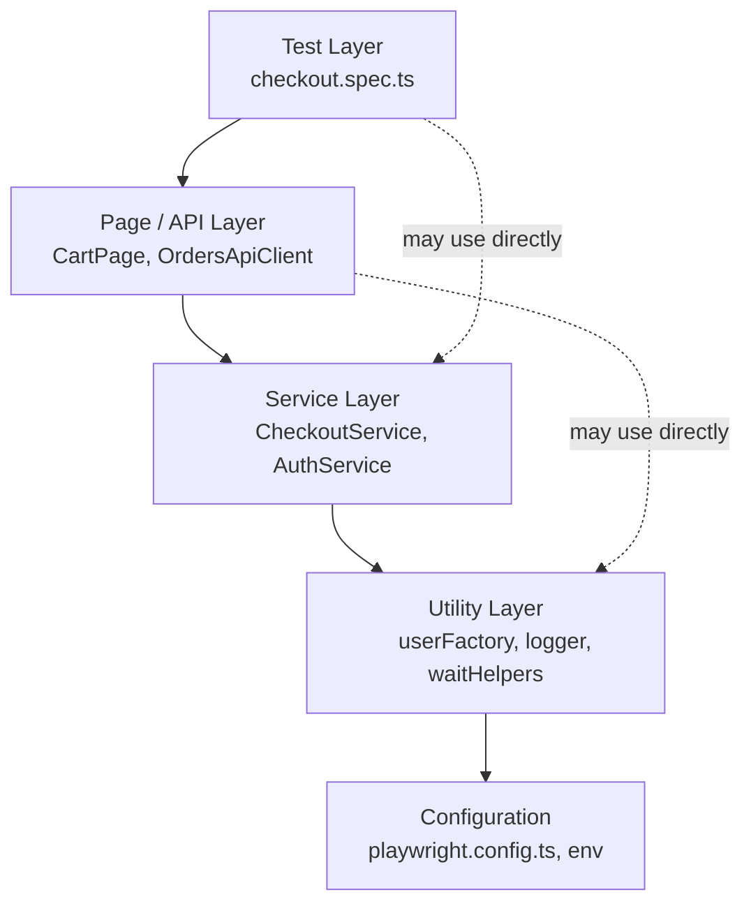
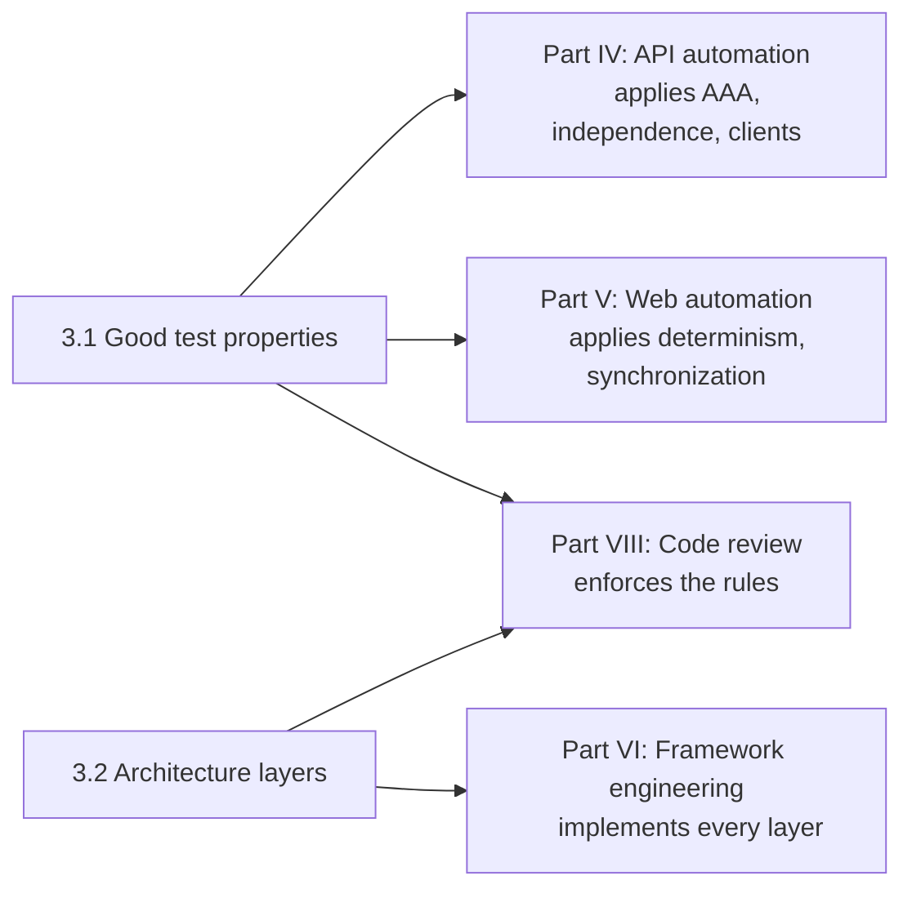

# Part III — Automation Fundamentals

[← Back to Table of Contents](../README.md)

**Level:** 🟡 Intermediate · **Chapters:** 2 · **Suggested pace:** Week 11 (2 sessions)

---

## Why this part exists

You can now write TypeScript. You could open Playwright today and produce something that runs.

That is exactly the moment to stop and ask a different question: **what makes an automated test worth having?**

Every team has a suite it does not trust. The symptoms are always the same — tests that pass on rerun, tests that must run in a specific order, tests that fail on Tuesdays because someone changed a record in the shared environment, tests whose failure message tells you nothing except that something happened. Nobody sets out to build that. It accumulates, one reasonable-looking shortcut at a time.

This part is short and contains almost no code. Its job is to give you the vocabulary and the standards you will apply for the remaining 21 weeks: independence, isolation, determinism, Arrange-Act-Assert, and the layered architecture that keeps a growing suite comprehensible.

Every design argument in Parts IV through VIII resolves back to these two chapters.

---

## Module learning objectives

By the end of Part III you will be able to:

1. **Define** the properties of a trustworthy automated test: independence, isolation, determinism, and clear intent.
2. **Evaluate** an existing test against those properties and **identify** which one it violates.
3. **Restructure** a test into explicit Arrange → Act → Assert phases.
4. **Choose** between shared setup/teardown and per-test data creation for a given scenario, and **justify** the choice.
5. **Explain** the responsibility of each layer in a layered automation architecture.
6. **Place** a proposed piece of code in the correct layer, and **recognize** a layer violation in review.
7. **Describe** the roles of the test runner, assertion library, reporter, logs, and artifacts during a failure investigation.
8. **Distinguish** reusability from premature abstraction, and **argue** when duplication is the better choice.

---

## Chapters in this part

| # | Chapter | Level | Core question |
|---|---|---|---|
| 3.1 | [Principles of Good Automated Tests](01-principles-of-good-automated-tests.md) | 🟡 | What makes a single test trustworthy, and what quietly destroys trust? |
| 3.2 | [Test Automation Architecture](02-test-automation-architecture.md) | 🟡 | How do you organize 500 tests so a stranger can still find their way? |

---

## The architecture you are heading toward

Chapter 3.2 introduces the layering that the rest of the course implements. Learn the names now; you will build each layer in order.

```text
Test Layer            What is being verified, in business language
    ↓
Page/API Layer        How to interact with one screen or one endpoint
    ↓
Service Layer         Multi-step business workflows (register, then log in, then seed a cart)
    ↓
Utility Layer         Generic helpers: data factories, date formatting, retries, logging
    ↓
Configuration         Environments, base URLs, credentials, timeouts, browsers
```

The single rule that makes this useful: **each layer may depend on the layer below it, never the one above.** A page object must not know which test is using it. A utility must not know about your login page.



Dotted edges are legal shortcuts. An arrow pointing upward would be an architecture violation, and Chapter 8.2 teaches you to catch those in code review.

---

## How this part connects to the rest of the course



Part III is where you learn the standards. Parts IV-VI are where you implement them. Part VIII is where you learn to enforce them on someone else's code.

---

## Prerequisite knowledge for this part

| Required | Where it came from |
|---|---|
| Test types and strategy vocabulary | [Part I](../part-1-testing-fundamentals/00-module-overview.md) |
| Functions, arrays, objects, interfaces | [Chapters 2.7-2.10](../part-2-programming-fundamentals/00-module-overview.md) |
| Async/await and Promises | [Chapter 2.12](../part-2-programming-fundamentals/12-asynchronous-programming.md) |
| Experience of duplication in your own code | Projects 1 and 2 |

Projects 1 and 2 matter here more than they look. When Chapter 3.2 argues for a utility layer, you will recognize the argument, because you already copied the same pass-rate calculation into three files.

---

## What you will produce

| Chapter | Artifact |
|---|---|
| 3.1 | A written audit of five supplied tests, naming the violated property in each and proposing a fix |
| 3.1 | A rewrite of a tangled test into clean Arrange → Act → Assert phases |
| 3.2 | A layer diagram for the demo e-commerce application, with each planned file assigned to a layer |
| 3.2 | A one-page "framework constitution": your rules for what may live where, to be enforced on your own capstone |

The framework constitution is not busywork. You will be graded against your own document in the capstone architecture defense, and you will be allowed to revise it — as long as you can explain what changed your mind.

---

## Time budget

| Activity | Hours |
|---|---|
| Sessions (2 × 90 min) | 3.0 |
| Reading | 1.5 |
| Exercises | 1.5 |
| Assignments | 2.5 |
| Quizzes | 0.5 |
| **Total** | **~9** |

---

## Common misconceptions this part corrects

| Misconception | Reality |
|---|---|
| "A passing test is a good test." | A test that cannot fail is worthless. A test that fails for the wrong reason is harmful. |
| "Tests can share data if I'm careful." | "Careful" does not survive parallel execution, retries, or a colleague adding a test next month. |
| "Test order dependency is fine, I control the order." | The moment you enable parallelism (Chapter 6.7) or run a single test in isolation to debug it, order dependency becomes an outage. |
| "Determinism means no randomness." | Determinism means the *verdict* is stable. Random *data* is often the way to achieve it, because unique data removes collisions. |
| "Setup and teardown belong in `beforeAll` for speed." | Speed bought with shared mutable state is repaid with untrustworthy failures. |
| "More layers means better architecture." | Layers cost indirection. Each one must earn its place by removing real duplication or real coupling. |
| "Reusability is always good." | Premature abstraction is harder to unwind than duplication. Chapter 3.2 gives you the rule of thumb: abstract on the third occurrence, not the first. |
| "Logs and reports are for managers." | They are your primary diagnostic instrument. A failure you cannot diagnose from artifacts costs you a rerun every time. |

---

## Gate before moving on

Do not start Part IV until you can do this:

> Given a test file you have never seen, identify (a) which reliability property each test violates, if any, (b) where its Arrange, Act, and Assert phases are, and (c) which layer each piece of its code belongs in.

That is precisely the review skill you will need when Chapter 4.7 asks you to refactor duplicated request code into an API client, and again when Chapter 6.1 asks you to extract page objects.

---

## What comes next

Part IV takes these principles into practice on the simplest real interface available: HTTP APIs. No rendering, no locators, no timing — just requests, responses, and the discipline you just learned.

→ [Instructor Notes for Part III](instructor-notes.md)
→ [Chapter 3.1 — Principles of Good Automated Tests](01-principles-of-good-automated-tests.md)
