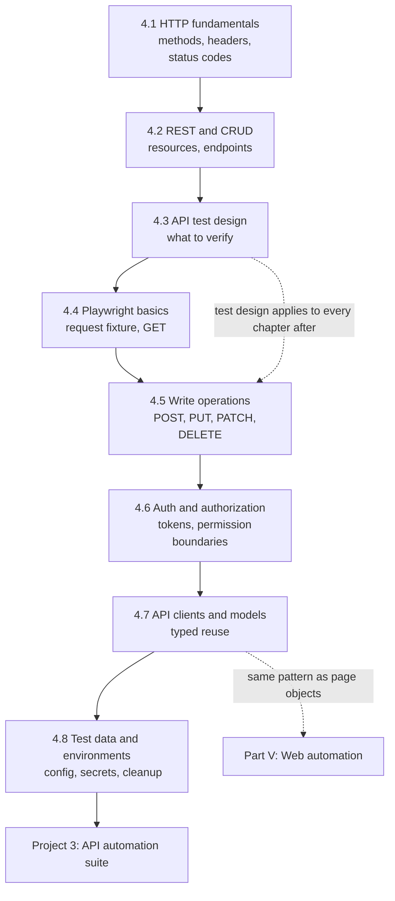

# Part IV — API Testing and Automation

[← Back to Table of Contents](../README.md)

**Level:** 🟢 → 🔴 · **Chapters:** 8 · **Suggested pace:** Weeks 12-16 (8 chapter sessions + 2 project sessions)

---

## Why API testing comes before Web automation

Almost every automation course opens a browser first. This one does not, for four reasons that will save you months of frustration:

1. **Failures are unambiguous.** An API test has no rendering, no animation, no element that exists but is covered by a modal. If the test is unreliable, it is your test's fault — and that is exactly the feedback a learner needs.
2. **The feedback loop is seconds, not minutes.** You will run tests hundreds of times while learning. At 200 ms per API call instead of 8 seconds per browser flow, you get an order of magnitude more practice per hour.
3. **Test design skills transfer upward, not downward.** Learning to think about status codes, negative cases, boundaries, and authorization boundaries at the API layer makes you a better UI tester. The reverse is not true.
4. **It is where the real coverage should live.** Part I's test pyramid argued for pushing checks down. Part IV is where you learn to actually do it, so that in Part V you automate only what genuinely requires a browser.

By the end of this part you will have a typed, reusable API automation suite running against multiple environments — a real deliverable, before you have opened a single browser in anger.

---

## Module learning objectives

By the end of Part IV you will be able to:

1. **Explain** the client/server model and **identify** every component of an HTTP request and response.
2. **Select** the correct HTTP method and **predict** the expected status code for a given operation.
3. **Map** REST resources and CRUD operations onto endpoints, and **critique** an endpoint design.
4. **Design** a test set for an endpoint covering status codes, body content, headers, schema, authentication, authorization, negative cases, boundaries, data integrity, and response time.
5. **Implement** Playwright API tests for GET, POST, PUT, PATCH, and DELETE, including headers, bodies, and query parameters.
6. **Authenticate** a suite with tokens and **assert** authorization boundaries between users.
7. **Refactor** duplicated request code into a typed, reusable API client with request and response models.
8. **Configure** a suite to run against multiple environments without hardcoded URLs, IDs, or secrets.

---

## Chapters in this part

| # | Chapter | Level | What it unlocks |
|---|---|---|---|
| 4.1 | [HTTP Fundamentals](01-http-fundamentals.md) | 🟢 | Reading a request/response pair with confidence |
| 4.2 | [REST APIs and CRUD](02-rest-api-and-crud.md) | 🟢 | Predicting an API's shape from its resources |
| 4.3 | [Designing API Test Cases](03-designing-api-test-cases.md) | 🟡 | Deciding *what* to verify before writing code |
| 4.4 | [Playwright API Testing Basics](04-playwright-api-testing-basics.md) | 🟡 | First running tests: setup, `request`, GET, assertions |
| 4.5 | [Write Operations: POST, PUT, PATCH, DELETE](05-playwright-api-write-operations.md) | 🟡 | Creating and mutating data, and cleaning up after yourself |
| 4.6 | [API Authentication and Authorization](06-api-authentication-and-authorization.md) | 🟡 | Tokens, headers, and proving user A cannot read user B's data |
| 4.7 | [Reusable API Clients and Models](07-reusable-api-clients-and-models.md) | 🔴 | Turning 40 duplicated requests into a maintainable client |
| 4.8 | [API Test Data and Environment Configuration](08-api-test-data-and-environments.md) | 🔴 | One suite, many environments, no secrets in the repo |

**Project 3** — [E-Commerce API Automation Suite](../projects/project-3-api-automation.md) 🟡, after Chapter 4.8.

---

## How the chapters connect

Chapters 4.1-4.3 are knowledge and design; no automation code. Chapters 4.4-4.6 are hands-on automation, deliberately written in a duplicated, script-like style. Chapter 4.7 then makes you refactor your own duplication into a client — which is the same lesson Part VI applies to the UI with page objects. Feeling the duplication before removing it is the design of the module, not an oversight.

---

## Prerequisite knowledge for this part

| Required | Where it came from |
|---|---|
| Objects, arrays of objects, destructuring | [Chapter 2.9](../part-2-programming-fundamentals/09-objects.md) |
| Interfaces, type aliases, unions, optional properties | [Chapter 2.10](../part-2-programming-fundamentals/10-typescript-fundamentals.md) |
| `try`/`catch`, custom errors, useful error messages | [Chapter 2.11](../part-2-programming-fundamentals/11-error-handling.md) |
| **`async`/`await`, Promises, `Promise.all()`** | [Chapter 2.12](../part-2-programming-fundamentals/12-asynchronous-programming.md) |
| JSON parsing, stringifying, nested access | [Chapter 2.13](../part-2-programming-fundamentals/13-json.md) |
| Test independence, isolation, determinism, AAA | [Chapter 3.1](../part-3-automation-fundamentals/01-principles-of-good-automated-tests.md) |
| Layered architecture vocabulary | [Chapter 3.2](../part-3-automation-fundamentals/02-test-automation-architecture.md) |

The async requirement is absolute. Every Playwright API call returns a Promise, and a missing `await` in an API test produces a test that passes while asserting nothing. If Chapter 2.12's bug hunt was not comfortable, redo it before Chapter 4.4.

---

## Tooling introduced here

| Tool | Chapter | Purpose |
|---|---|---|
| Browser DevTools Network tab | 4.1 | Observing real requests before writing any |
| A REST client (Postman, Insomnia, or `curl`) | 4.1-4.2 | Manual exploration of endpoints |
| **Playwright Test** (`npm init playwright@latest`) | 4.4 | The runner and assertion library you will use for the rest of the course |
| `APIRequestContext` / the `request` fixture | 4.4 | Making HTTP calls from tests |
| `.env` files and `process.env` | 4.8 | Environment configuration without committed secrets |
| The demo e-commerce API (Docker) | 4.4 onward | A controllable target you can reset and reseed |

A deliberate note on Postman: it is used here for *exploration only*. Manual collections are excellent for discovery and terrible as a regression suite — they are hard to review, hard to version, and hard to run in CI. Everything that must run repeatedly gets written in TypeScript.

---

## What you will produce

| Chapter | Artifact |
|---|---|
| 4.1 | An annotated request/response breakdown captured from a real application |
| 4.2 | A resource-to-endpoint map for the demo shop, with a critique of two poor designs |
| 4.3 | A complete test matrix for one endpoint: positive, negative, boundary, auth, schema, timing |
| 4.4 | Your first passing Playwright API tests, with meaningful status and body assertions |
| 4.5 | A full CRUD lifecycle test that creates, reads, updates, and deletes its own data |
| 4.6 | An authenticated suite plus authorization tests proving cross-user access is denied |
| 4.7 | A typed `ProductsApiClient` and `OrdersApiClient` replacing all raw requests in your tests |
| 4.8 | The same suite running against `local` and `staging` by changing one environment variable |
| **Project 3** | A complete API suite over auth, users, products, cart, and orders with reporting |

Every artifact feeds the next. Your Chapter 4.3 test matrix becomes the plan for Project 3, and your Chapter 4.7 clients become the service layer your capstone UI tests use to seed data without clicking through the interface.

---

## Time budget

| Activity | Hours |
|---|---|
| Sessions (10 × 90 min) | 15.0 |
| Reading | 6.0 |
| Exercises | 8.0 |
| Chapter assignments | 10.0 |
| Project 3 | 12.0 |
| Quizzes and review | 3.0 |
| **Total** | **~54** |

---

## Common misconceptions this part corrects

| Misconception | Reality |
|---|---|
| "API testing means checking the status code." | Status code is one of ten things worth verifying. A 200 with a wrong body is a defect that a status-only test will never catch. |
| "`expect(response.ok()).toBeTruthy()` is a good assertion." | It passes for any 2xx. It is the most common weak assertion in submitted work. |
| "A 200 means success." | An API can return 200 with `{"error": "insufficient stock"}`. Read the body. |
| "PUT and PATCH are interchangeable." | PUT replaces the resource, PATCH modifies part of it. Sending a partial body to PUT can silently erase fields — a genuine bug worth testing for. |
| "Negative testing means sending garbage." | Negative testing means asserting the *specific* documented failure: correct status, correct error shape, correct message, and no partial side effects. |
| "Authentication and authorization are the same thing." | Authentication asks who you are; authorization asks what you may do. The second is where the interesting bugs live. |
| "Tests should reuse a seeded account and known record IDs." | Hardcoded IDs break on a fresh environment and collide under parallel execution. Create what you need. |
| "Schema validation is spot-checking two fields." | It means asserting the complete contract: required fields present, types correct, no unexpected nulls. |
| "If the response is fast on my machine, performance is fine." | Response-time assertions belong in the suite, with generous, deliberate thresholds — not as a performance test, but as a smoke alarm. |
| "I'll add the API client later once tests work." | The refactor in Chapter 4.7 is the learning objective. Skipping it produces a suite nobody can extend. |

---

## Gate before moving on

Do not start Part V until all of these are true of your Project 3 suite:

- It passes three consecutive runs, in any order, with `--workers=4`
- It passes against a freshly reset database with no manual preparation
- No test contains a hardcoded record ID, URL, or password
- Every test has a one-sentence answer to "this fails if X breaks"
- Deliberately breaking one endpoint's response body makes exactly the relevant tests go red

The fifth point is the one learners skip and graders always check.

---

## What comes next

Part V opens the browser. Everything you learned about test design, assertions, independence, and clients still applies — but now you also have to deal with rendering, timing, and locators. Learners who did Part IV properly find Part V hard for the *right* reasons: the new problems are genuinely browser problems, not test-design problems they never solved.

→ [Instructor Notes for Part IV](instructor-notes.md)
→ [Chapter 4.1 — HTTP Fundamentals](01-http-fundamentals.md)
