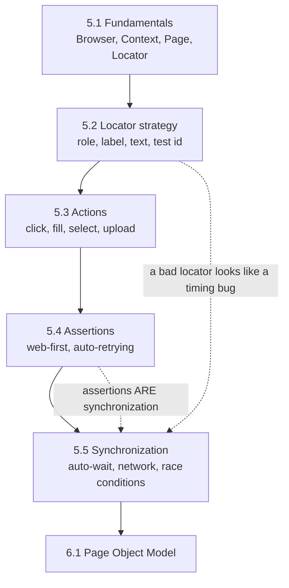

# Part V — Web Automation with Playwright

[← Back to Table of Contents](../README.md)

**Level:** 🟡 → 🔴 · **Chapters:** 5 · **Suggested pace:** Weeks 17-19 (6 sessions)

---

## Why this part comes now, and not on day one

You have waited sixteen weeks to open a browser. Here is what that bought you.

You can already program, design test cases, assert meaningfully, own your test data, authenticate a suite, and structure a reusable client. So when a UI test misbehaves in the next three weeks, the cause will be one of exactly two new things: **a locator that does not identify what you meant**, or **a timing assumption that is not guaranteed**. That is a narrow, learnable problem space.

Learners who start with Playwright on day one cannot make that distinction. Every failure looks the same to them, so they reach for the universal non-solution — a sleep — and build a suite that is slow, unreliable, and impossible to reason about. This part exists to make sure you never do that.

One more framing that matters: the browser is the **most expensive** place to verify anything. It is slow, it is brittle, and it costs the most to maintain. Everything you learned in Part IV was preparation for keeping your UI suite deliberately small and focused on what genuinely requires a rendered page.

---

## Module learning objectives

By the end of Part V you will be able to:

1. **Explain** the relationship between Browser, BrowserContext, and Page, and **justify** context isolation as a test-independence mechanism.
2. **Select** locators using the preference order role → label → text → placeholder → test ID → CSS → XPath, and **defend** any deviation.
3. **Refactor** a brittle CSS or XPath locator into a resilient, intent-revealing one.
4. **Perform** clicks, fills, selects, checkbox and radio interactions, file uploads, and keyboard and mouse actions.
5. **Assert** visibility, text, value, attribute, URL, title, element count, and element state using web-first assertions.
6. **Explain** Playwright's auto-waiting and **identify** what it does and does not cover.
7. **Replace** hard waits with assertion-based or network-based synchronization.
8. **Diagnose** the cause of a flaky UI test and **articulate** why `waitForTimeout` is a defect rather than a fix.

---

## Chapters in this part

| # | Chapter | Level | Core question |
|---|---|---|---|
| 5.1 | [Playwright Fundamentals](01-playwright-fundamentals.md) | 🟡 | What are the objects I am actually working with, and how does a test start clean? |
| 5.2 | [Locator Strategy](02-locator-strategy.md) | 🟡 | How do I identify an element so that it still works after a redesign? |
| 5.3 | [Browser Actions](03-browser-actions.md) | 🟡 | How do I drive every kind of control a real user touches? |
| 5.4 | [Web Assertions](04-web-assertions.md) | 🟡 | How do I verify outcomes without introducing a race condition? |
| 5.5 | [Synchronization and Flaky Tests](05-synchronization-and-flaky-tests.md) | 🔴 | Why do tests fail intermittently, and what do I do instead of sleeping? |

Chapter 5.5 gets two sessions. It is the most consequential chapter in the course for the long-term value of your suite.

---

## How the chapters connect



The dotted edges carry the module's two central insights. First, **most "flaky timing problems" are actually locator problems** — an ambiguous locator that resolves to a different element depending on render order. Second, **a web-first assertion is a synchronization primitive**, because it retries until it passes or times out. Learners who internalize the second insight never write a hard wait again.

---

## The locator preference order

You will use this constantly, so it belongs on the wall:

| Priority | Locator | Example | Why here |
|---|---|---|---|
| 1 | **Role** | `page.getByRole("button", { name: "Add to cart" })` | Matches how users and assistive technology perceive the page; survives styling and DOM restructuring |
| 2 | **Label** | `page.getByLabel("Email address")` | Form semantics; stable and meaningful |
| 3 | **Text** | `page.getByText("Order confirmed")` | Reflects user-visible content; fragile only under copy changes |
| 4 | **Placeholder** | `page.getByPlaceholder("Search products")` | Useful when no label exists (which is itself an accessibility finding) |
| 5 | **Test ID** | `page.getByTestId("cart-badge")` | Explicit contract with developers; immune to copy changes but invisible to users |
| 6 | **CSS** | `page.locator(".cart-badge")` | Couples tests to styling; breaks on refactors |
| 7 | **XPath** | `page.locator("//div[3]/span")` | Couples tests to document structure; the most brittle option available |

**The rule:** start at the top and stop at the first option that uniquely and meaningfully identifies the element. Every step down the list is a decision to accept more coupling, and Chapter 5.2 requires you to justify it in a comment.

An important consequence: if an element cannot be reached by role, label, or text, that is often a genuine accessibility defect in the application. Automation engineers who report those findings are unusually valuable.

---

## Why `waitForTimeout` is banned in this course

```ts
await page.waitForTimeout(5000);   // never do this
```

This line is prohibited in all submitted work from Chapter 5.5 onward. Four reasons:

1. **It is always either too short or too long.** Too short on a loaded CI machine (flaky), too long on a fast one (slow). Both, in the same suite, on different days.
2. **It hides the real signal.** You are waiting for *something specific* — a response, a rendered element, a state change. Naming that thing makes the test both faster and self-documenting.
3. **It multiplies.** Fifty tests with a five-second sleep is four minutes of pure waiting per run, permanently, and it grows every sprint.
4. **It teaches the wrong reflex.** The engineer who sleeps to fix flakiness never learns to diagnose. That habit is career-limiting.

The replacements, in order of preference: a web-first assertion (`await expect(locator).toBeVisible()`), a locator-level wait built into the action, `waitForResponse` when the UI provides no visible signal, and `waitForFunction` for genuinely custom conditions. Chapter 5.5 covers all four and when each is appropriate.

---

## Prerequisite knowledge for this part

| Required | Where it came from |
|---|---|
| `async`/`await`, Promises, and spotting a missing `await` | [Chapter 2.12](../part-2-programming-fundamentals/12-asynchronous-programming.md) |
| Objects, interfaces, typed function signatures | [Chapters 2.9-2.10](../part-2-programming-fundamentals/00-module-overview.md) |
| Test independence, isolation, determinism, AAA | [Chapter 3.1](../part-3-automation-fundamentals/01-principles-of-good-automated-tests.md) |
| Playwright Test project setup, `expect`, running and filtering tests | [Chapter 4.4](../part-4-api-testing-and-automation/04-playwright-api-testing-basics.md) |
| Authentication via API, and creating your own test data | [Chapters 4.6, 4.8](../part-4-api-testing-and-automation/00-module-overview.md) |
| Basic HTML structure and the DevTools element inspector | Taught inline in Chapter 5.2 — no prior knowledge assumed |

You do not need to know CSS or the DOM in advance. Chapter 5.2 teaches exactly as much as a locator strategy requires, and deliberately no more.

---

## What you will produce

| Chapter | Artifact |
|---|---|
| 5.1 | A first browser test with an isolated context, plus a written explanation of what `page` gave you for free |
| 5.2 | A locator audit: twenty supplied locators rated and rewritten, each with a justification |
| 5.3 | A full form-interaction script covering text, select, checkbox, radio, upload, and keyboard input |
| 5.4 | An assertion suite verifying visibility, text, value, attribute, URL, title, count, and state |
| 5.5 | A "de-flaking" exercise: a supplied suite with six hard waits, rewritten with correct synchronization, proven stable over 20 consecutive runs |

The Chapter 5.5 artifact is the one to keep. Being able to say "I took a suite that failed one run in five and made it pass twenty consecutive runs, and here is what each fix was" is a genuinely strong interview answer.

**Project 4** — [E-Commerce Web Automation](../projects/project-4-web-automation.md) follows in Week 25, after Chapter 6.1 gives you Page Objects to organize it.

---

## Time budget

| Activity | Hours |
|---|---|
| Sessions (6 × 90 min) | 9.0 |
| Reading | 4.0 |
| Exercises | 6.0 |
| Chapter assignments | 7.0 |
| Quizzes and review | 2.0 |
| **Total** | **~28** |

---

## Common misconceptions this part corrects

| Misconception | Reality |
|---|---|
| "UI automation is the real automation." | It is the slowest, most expensive, least stable layer. Use it for what only it can verify. |
| "A test that opens a browser is more thorough." | It is more *end-to-end*, which is not the same as more thorough. A UI test rarely covers edge cases well. |
| "If it's flaky, add a wait." | If it is flaky, diagnose it. Chapter 5.5 gives you six categories of cause and a method for each. |
| "Playwright auto-waits, so timing is handled." | Auto-waiting covers actionability of a located element. It does not know your app finished loading data, or that a toast has replaced another toast. |
| "CSS selectors are fine, they're what developers use." | Developers change class names freely because they are styling, not contract. Roles and labels are closer to contract. |
| "XPath is more powerful." | Power is the problem. `//div[3]/span` encodes document structure that will change. |
| "`isVisible()` and `toBeVisible()` are the same." | `isVisible()` returns a boolean *now*, with no retry. `expect(...).toBeVisible()` retries. Using the first in an `if` is a classic race condition. |
| "One test should cover the whole user journey." | Long journeys fail late, diagnose poorly, and duplicate coverage. Keep flows focused, and seed prior state through the API. |
| "I need to log in through the UI in every test." | Log in through the UI once, in a test that verifies login. Everywhere else, reuse state (Chapter 6.3). |
| "A screenshot is enough to debug a failure." | A trace gives you the DOM, the network, the console, and a timeline. Chapter 6.8 makes traces your default. |

---

## Gate before moving on

Do not start Part VI until all of these are true:

- You can automate login → search → open product → add to cart with **zero** `waitForTimeout` calls
- Every locator in your code is role-, label-, text-, or test-ID-based, or has a written justification
- Your tests pass 10 consecutive runs (`--repeat-each=10`)
- You can explain, for one specific test, exactly what each `await expect(...)` is synchronizing on
- You have felt the duplication: the same login and navigation code copied across several test files

That last point is intentional. Part VI opens with Page Objects, and the abstraction only makes sense to someone who has already written the mess it cleans up.

---

## What comes next

Part VI turns your scripts into a framework: page objects, fixtures, reusable authentication, data factories, configuration, cross-browser projects, parallelism, debugging, and flake diagnosis. Each chapter solves a specific pain you will have just experienced firsthand.

→ [Instructor Notes for Part V](instructor-notes.md)
→ [Chapter 5.1 — Playwright Fundamentals](01-playwright-fundamentals.md)
