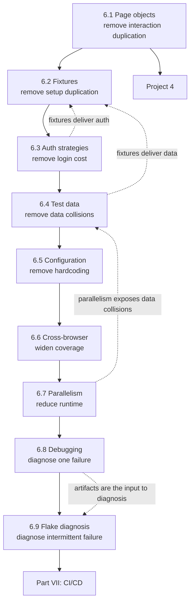

# Part VI — Framework Engineering

[← Back to Table of Contents](../README.md)

**Level:** 🟡 → 🔴 · **Chapters:** 9 · **Suggested pace:** Weeks 20-25 (9 chapter sessions + Project 4)

---

## Why this part exists

You can now write working Playwright tests. If you stopped here, you would have what most teams actually have: a folder of scripts that worked when they were written, that one person understands, that take too long to run, and that everyone is slightly afraid to change.

Part VI is the difference between *writing tests* and *owning a test framework*. Every chapter removes a specific pain you felt in Part V:

| The pain you just felt | The chapter that fixes it |
|---|---|
| "I've written the login steps in six files" | 6.1 Page Object Model |
| "Every test repeats the same setup" | 6.2 Fixtures |
| "Logging in through the UI takes 8 seconds per test" | 6.3 Authentication Strategies |
| "My tests collide because they use the same account" | 6.4 Test Data Management |
| "The base URL is hardcoded in 20 places" | 6.5 Configuration |
| "It works in Chrome, is it fine everywhere?" | 6.6 Cross-Browser and Mobile |
| "The suite takes 22 minutes" | 6.7 Parallel Execution and Sharding |
| "I can't tell why this failed without rerunning it" | 6.8 Debugging Playwright Tests |
| "It fails one run in twenty and I don't know why" | 6.9 Diagnosing Flaky Tests |

That mapping is the design of the module. Nothing here is introduced as best practice for its own sake; each abstraction is a response to a cost you have personally paid.

This is also where the course becomes genuinely 🔴 **advanced** — not because the syntax is harder, but because there is no single correct answer. Two competent engineers will design different page object hierarchies for the same application and both will be defensible. Part VI teaches you to make those choices deliberately and explain them, which is exactly what the capstone architecture defense assesses.

---

## Module learning objectives

By the end of Part VI you will be able to:

1. **Design** page and component classes with clear responsibilities, and **recognize** over-abstraction.
2. **Implement** custom fixtures for authenticated pages, API clients, and seeded data, and **explain** fixture scope and teardown.
3. **Reuse** authentication state via `storageState` or API-issued tokens instead of logging in through the UI.
4. **Build** data factories producing valid, unique, overridable entities, and **clean up** what they create.
5. **Configure** `playwright.config.ts` for base URLs, timeouts, retries, reporters, projects, and environments, keeping secrets out of the repository.
6. **Execute** a suite across Chromium, Firefox, WebKit, branded Chrome, and mobile emulation using projects.
7. **Configure** workers, full parallelism, and sharding, and **identify** tests that cannot safely run in parallel.
8. **Investigate** a failure using headed mode, the Inspector, the Trace Viewer, screenshots, video, and logs.
9. **Diagnose** a flaky test by category and **fix the cause** rather than adding a retry.

---

## Chapters in this part

| # | Chapter | Level | Core question |
|---|---|---|---|
| 6.1 | [Page Object Model](01-page-object-model.md) | 🟡 | How do I stop rewriting the same interactions, without building a cathedral? |
| 6.2 | [Fixtures](02-fixtures.md) | 🔴 | How does a test declare what it needs and get it, cleanly set up and torn down? |
| 6.3 | [Authentication Strategies](03-authentication-strategies.md) | 🔴 | How do I log in once and be authenticated everywhere? |
| 6.4 | [Test Data Management](04-test-data-management.md) | 🔴 | Where does test data come from, and who cleans it up? |
| 6.5 | [Configuration and Environments](05-configuration.md) | 🟡 | How does one suite run against local, staging, and production-like environments? |
| 6.6 | [Cross-Browser and Mobile Emulation](06-cross-browser-and-mobile.md) | 🟡 | What do I gain from three engines, and what does it cost me? |
| 6.7 | [Parallel Execution and Sharding](07-parallel-execution-and-sharding.md) | 🔴 | How do I make 400 tests finish in five minutes without them fighting each other? |
| 6.8 | [Debugging Playwright Tests](08-debugging-playwright-tests.md) | 🟡 | How do I find the cause of a failure without rerunning it ten times? |
| 6.9 | [Diagnosing Flaky Tests](09-diagnosing-flaky-tests.md) | 🔴 | How do I find and fix the real cause of intermittent failure? |

**Project 4** — [E-Commerce Web Automation](../projects/project-4-web-automation.md) 🟡 begins after Chapter 6.1 and is built through the module.

---

## How the chapters connect



The ordering is not arbitrary. Fixtures (6.2) come before authentication (6.3) and data (6.4) because fixtures are the *delivery mechanism* for both. Parallelism (6.7) comes after data management (6.4) because parallelism is what exposes every remaining shared-state defect — running before 6.4 would produce a week of unexplainable failures. Debugging (6.8) precedes flake diagnosis (6.9) because you cannot diagnose an intermittent failure without first being able to diagnose a reproducible one.

---

## The architecture you are building

By the end of this part, your project should look approximately like this:

```text
tests/
  api/                      API test specs
  web/                      UI test specs
pages/                      Page objects (one per page)
  components/               Reusable component objects (header, cart badge, product card)
services/                   Multi-step business workflows (registerAndLogin, seedCart)
api-clients/                Typed API clients from Chapter 4.7
models/                     Interfaces for domain entities and API payloads
fixtures/                   Custom fixtures composing everything above
data/
  factories/                Data factories producing unique valid entities
  static/                   Fixed reference data (country lists, currency codes)
utils/                      Generic helpers: logging, retry, formatting
config/                     Environment configuration
playwright.config.ts        Projects, reporters, timeouts, retries
.env.example                Documented variable names, never real secrets
```

This is the layered architecture from [Chapter 3.2](../part-3-automation-fundamentals/02-test-automation-architecture.md), made concrete. The dependency rule still holds: tests may use fixtures, pages, services, and clients; pages may use utils; nothing depends upward.

---

## Prerequisite knowledge for this part

| Required | Where it came from |
|---|---|
| Classes, objects, interfaces, typed methods | [Chapters 2.9-2.10](../part-2-programming-fundamentals/00-module-overview.md) |
| `async`/`await`, `Promise.all`, error handling | [Chapters 2.11-2.12](../part-2-programming-fundamentals/00-module-overview.md) |
| Layered architecture and abstraction timing | [Chapter 3.2](../part-3-automation-fundamentals/02-test-automation-architecture.md) |
| Typed API clients and models | [Chapter 4.7](../part-4-api-testing-and-automation/07-reusable-api-clients-and-models.md) |
| API authentication and environment config | [Chapters 4.6, 4.8](../part-4-api-testing-and-automation/00-module-overview.md) |
| Locators, actions, web-first assertions, synchronization | [Part V](../part-5-web-automation-playwright/00-module-overview.md) |
| **Personal experience of duplicated UI test code** | Part V exercises — this is a real prerequisite, not a formality |

---

## What you will produce

| Chapter | Artifact |
|---|---|
| 6.1 | `LoginPage`, `ProductsPage`, `CartPage`, `CheckoutPage`, plus a `Header` component object; your Part V scripts rewritten to use them |
| 6.2 | A `fixtures/` module providing `loggedInPage`, `apiClient`, and `seededProduct`, with teardown |
| 6.3 | Authentication once per run via API + `storageState`, with a measured before/after runtime comparison |
| 6.4 | `userFactory`, `productFactory`, `orderFactory` producing unique data, plus reliable cleanup |
| 6.5 | A `playwright.config.ts` with environment-driven base URLs and a committed `.env.example` |
| 6.6 | Projects for Chromium, Firefox, WebKit, branded Chrome, and one mobile profile, plus a written report on which failures were genuine engine differences |
| 6.7 | The suite running fully parallel with a documented list of tests that must be serialized and why |
| 6.8 | A debugging walkthrough: one failure diagnosed from artifacts alone, written up step by step |
| 6.9 | A flake investigation report: category, evidence, root cause, fix, and proof of 30 stable runs |
| **Project 4** | [E-Commerce Web Automation](../projects/project-4-web-automation.md) — the full purchase flow, built on this architecture |

The Chapter 6.3 before/after measurement and the Chapter 6.9 investigation report are the two artifacts worth keeping for interviews. "I reduced suite runtime from 14 minutes to 3 by reusing authentication state and parallelizing, and here is the flake I fixed to make that safe" is a senior-sounding sentence you will have earned.

---

## Time budget

| Activity | Hours |
|---|---|
| Sessions (12 × 90 min) | 18.0 |
| Reading | 7.0 |
| Exercises | 9.0 |
| Chapter assignments | 14.0 |
| Project 4 | 16.0 |
| Quizzes and review | 3.0 |
| **Total** | **~67** |

---

## Common misconceptions this part corrects

| Misconception | Reality |
|---|---|
| "A page object is a file with locators in it." | A page object exposes *intent* (`login(user)`), not plumbing (`getUsernameField()`). Locators are an implementation detail it hides. |
| "Page objects should assert." | Assertions belong in tests, where the intent lives. A page object that asserts makes the test unable to state what it is verifying. |
| "More abstraction is more professional." | Every layer costs indirection. `BasePage` with eleven unused protected methods is worse than mild duplication. |
| "Fixtures are just `beforeEach` with extra steps." | Fixtures are composable, on-demand, typed, and torn down automatically. They let a test *declare* its needs rather than inherit a hook. |
| "Logging in through the UI in every test is more realistic." | It is realistic and wasteful. Test the login flow once through the UI; reuse the state everywhere else. |
| "Shared seeded data is more efficient." | Until two tests mutate the same record. Under parallelism, shared mutable data is the single largest source of flakiness. |
| "Random data means unpredictable tests." | Unique data means *independent* tests. Randomness in identifiers, determinism in assertions. |
| "Cross-browser means running everything on every engine." | It means running the *right subset* on other engines. Full triple-run cost rarely pays for itself. |
| "More workers is always faster." | Beyond CPU capacity, workers contend and both runtime and stability degrade. Measure, do not guess. |
| "Retries make the suite reliable." | Retries make the suite *green*. Reliability comes from removing the cause; retries are a controlled concession, and every retry should be tracked. |
| "Debugging means adding console.log and rerunning." | Traces contain the DOM, network, console, and timeline of the failed run. Rerunning is what you do when you have not read the trace. |
| "Flaky tests are inevitable at this scale." | Flakiness has a finite set of causes and each has a technique. Chapter 6.9 covers all of them. |

---

## Gate before moving on

Do not start Part VII until all of these are true of your Project 4 suite:

- No locators appear outside page or component objects
- No test logs in through the UI except the test that verifies login
- Every test creates its own data and cleans it up, including on failure
- No base URL, credential, or record ID is hardcoded anywhere
- `npx playwright test --workers=4 --repeat-each=3` passes cleanly, three times in a row
- You can name every test that must be serialized and explain why
- Given a failure, you can diagnose it from artifacts without rerunning

The sixth point is the one that separates learners who understand parallelism from learners who got lucky.

---

## What comes next

Part VII takes your framework off your laptop: Git workflow, a Jenkins pipeline that runs the suite and publishes reports and artifacts, and a Docker image that makes the environment reproducible. Part VIII then turns the lens back on your code with clean-code principles, code review, and full architecture design.

→ [Instructor Notes for Part VI](instructor-notes.md)
→ [Chapter 6.1 — Page Object Model](01-page-object-model.md)
