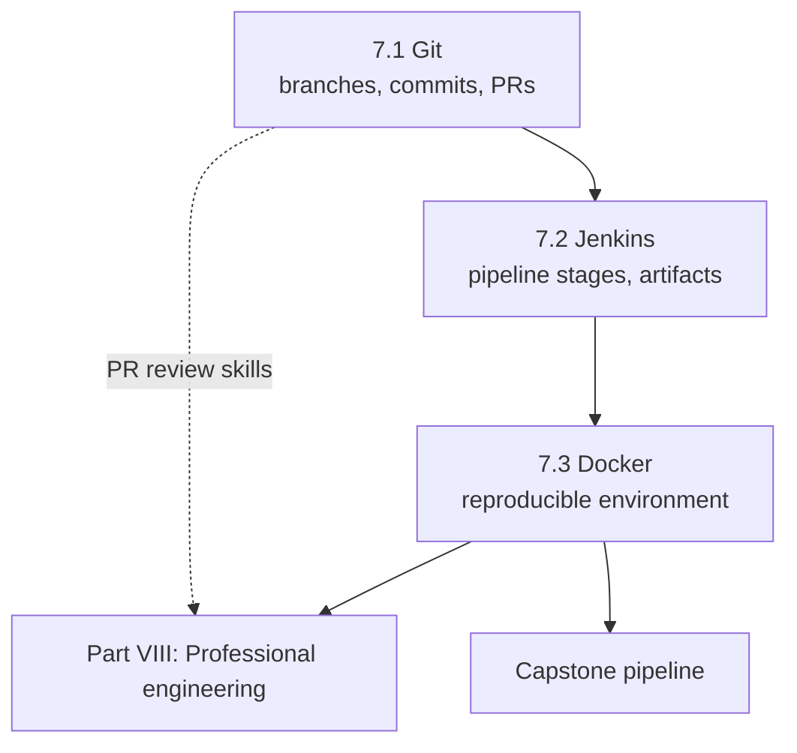

# Part VII — CI/CD

[← Back to Table of Contents](../README.md)

**Level:** 🟢 → 🔴 · **Chapters:** 3 · **Suggested pace:** Weeks 26-27 (3 chapter sessions + 1 pipeline lab)

---

## Why this part exists

A test suite that only runs when you decide to run it is a personal hobby. It catches the bugs you happen to look for, on the days you happen to have time, on the one machine that happens to be configured correctly.

Automation earns its cost when it runs **automatically, on every change, in an environment nobody has to remember to set up.** That is what this part builds:

```text
Git
 ↓
Jenkins
 ↓
Install dependencies
 ↓
Run tests
 ↓
Generate report
 ↓
Publish artifacts
```

There is a second, less obvious reason this part matters. CI is where your suite's hidden assumptions get exposed. The Node version you have, the browsers already installed, the `.env` file on your desktop, the timezone of your laptop, the fact that your machine is idle while a CI agent runs four jobs at once — every one of those is an assumption, and CI will find all of them. Learners who reach Part VII with a disciplined Part VI framework have a mild week. Learners who cut corners in 6.4 and 6.5 discover it here.

---

## Module learning objectives

By the end of Part VII you will be able to:

1. **Use** branches, commits, pushes, pulls, and merges to manage a test repository, and **resolve** a simple merge conflict.
2. **Open** a pull request for your own test code and **respond** to review comments.
3. **Write** a Jenkins declarative pipeline that checks out code, installs dependencies, runs tests, publishes a report, and archives artifacts.
4. **Pass** configuration and secrets into a pipeline using environment variables and credentials rather than committed files.
5. **Handle** failure correctly in a pipeline: fail the build, still publish the report, and archive traces and screenshots.
6. **Build** a Docker image containing the correct browser dependencies and **run** the suite reproducibly inside a container.
7. **Diagnose** why a suite passes locally and fails in CI, and **explain** the difference in terms of environment, timing, and state.

---

## Chapters in this part

| # | Chapter | Level | Core question |
|---|---|---|---|
| 7.1 | [Git for Automation Engineers](01-git-for-automation-engineers.md) | 🟢 | How do I collaborate on test code without losing work or blocking others? |
| 7.2 | [Jenkins Pipelines](02-jenkins-pipelines.md) | 🟡 | How does my suite run automatically and report to the whole team? |
| 7.3 | [Docker for Test Automation](03-docker-for-test-automation.md) | 🔴 | How do I make "it works on my machine" irrelevant? |

---

## How the chapters connect



Git comes first because a pipeline's first stage is a checkout — CI is unexplainable without it. Docker comes last because it solves a problem you must first experience: the pipeline that fails because the agent has a different Node version or is missing a browser dependency.

---

## Prerequisite knowledge for this part

| Required | Where it came from |
|---|---|
| A working test suite worth running automatically | [Part VI](../part-6-framework-engineering/00-module-overview.md) and Project 4 |
| Environment-driven configuration with no hardcoded URLs | [Chapter 6.5](../part-6-framework-engineering/05-configuration.md) |
| Tests that create their own data and clean up | [Chapter 6.4](../part-6-framework-engineering/04-test-data-management.md) |
| Parallel-safe tests | [Chapter 6.7](../part-6-framework-engineering/07-parallel-execution-and-sharding.md) |
| Traces, screenshots, and HTML reports configured | [Chapter 6.8](../part-6-framework-engineering/08-debugging-playwright-tests.md) |
| Basic terminal usage | [Chapter 2.1](../part-2-programming-fundamentals/01-thinking-like-a-programmer.md) |

If your suite is not yet parallel-safe and self-cleaning, fix that before starting 7.2. CI amplifies those defects rather than tolerating them.

---

## Tooling introduced here

| Tool | Chapter | How it is used in this course |
|---|---|---|
| Git CLI + a hosted remote (GitHub/GitLab/Bitbucket) | 7.1 | Branching, committing, pull requests, review |
| **Jenkins** (run locally in Docker) | 7.2 | Declarative pipelines, credentials, HTML Publisher, artifact archiving |
| **Docker** | 7.3 | Building a test image, running the suite in a container, `docker compose` for app + tests |
| Playwright's official Docker images | 7.3 | Correct browser and system dependencies without hand-installing them |

Jenkins runs locally in a container so every learner has an identical instance and admin rights, without needing a corporate server. The concepts transfer directly: a stage is a stage whether it is Jenkins, GitHub Actions, or GitLab CI, and the reasoning about artifacts, secrets, and failure handling is identical.

---

## The pipeline you will build

```groovy
pipeline {
  agent any

  environment {
    BASE_URL = "${params.BASE_URL}"
    API_TOKEN = credentials('demo-api-token')   // never a committed value
  }

  stages {
    stage('Checkout')     { /* git clone the branch under test */ }
    stage('Install')      { /* npm ci, then playwright install --with-deps */ }
    stage('Test')         { /* npx playwright test --workers=4 */ }
    stage('Report')       { /* publish the HTML report */ }
  }

  post {
    always  { /* publish report, archive traces, screenshots, videos, JUnit XML */ }
    failure { /* notify, and keep artifacts for the investigation */ }
  }
}
```

Two details carry most of the learning. First, **`post { always { ... } }` matters more than the happy path** — a pipeline that publishes reports only when tests pass is useless, because the run you need evidence from is the failing one. Second, **`credentials()` instead of a literal** is the difference between a professional pipeline and a security incident.

---

## What you will produce

| Chapter | Artifact |
|---|---|
| 7.1 | A repository with a real branch-and-PR history, one resolved merge conflict, and a peer review you responded to |
| 7.2 | A working `Jenkinsfile` running your suite, publishing an HTML report, and archiving traces on failure |
| 7.2 | A parameterized build that runs against a chosen environment and test tag |
| 7.3 | A `Dockerfile` for your suite plus a `docker compose` setup running the demo app and tests together |
| 7.3 | A written comparison: the same suite run locally versus in the container, including any behavior differences you found |
| **CI/CD project** | The full pipeline, graded at 10% of the course — requirements in [Assessment Strategy §6](../00-course-overview/04-assessment-strategy.md#6-project-rubrics) |

The written comparison in 7.3 is more valuable than it sounds. The differences learners find — timezone, locale, font rendering affecting a visual check, fewer CPUs changing timing — are exactly the class of problem that makes CI feel mysterious to people who never did this exercise.

---

## Time budget

| Activity | Hours |
|---|---|
| Sessions (4 × 90 min) | 6.0 |
| Reading | 2.5 |
| Exercises | 3.0 |
| CI/CD project | 8.0 |
| Quizzes and review | 1.5 |
| **Total** | **~21** |

---

## Common misconceptions this part corrects

| Misconception | Reality |
|---|---|
| "Git is just backup." | Git is how a team works on the same code without blocking each other, and how CI knows what to test. |
| "I'll commit everything at the end of the day." | Commits are units of reasoning. `git log` is documentation, and a legible history is part of the CI/CD grade. |
| "Force push fixes mistakes." | It destroys history other people may depend on. Learn `revert` and `reset --soft` before reaching for force. |
| "CI is DevOps's job." | The pipeline that runs *your* tests is *your* responsibility, including its reliability and its noise level. |
| "If the pipeline is green, we're fine." | A pipeline that never fails may be running nothing. Verify it can fail: break a test on purpose and watch the build go red. |
| "Publish the report in the success branch." | Reports and artifacts must publish in `post { always }`, because failures are what you need evidence for. |
| "Secrets in Jenkins environment variables are fine as literals." | Use the credentials store. Literals leak into logs, build pages, and screenshots. |
| "The suite fails in CI because Jenkins is slow." | Usually it fails because the suite assumed a fast, idle, pre-configured machine. That assumption is the bug. |
| "Docker is for deploying applications." | For QA it is a reproducibility tool: pinned browsers, pinned system libraries, identical everywhere. |
| "I'll install browsers in the pipeline each run." | Works, and wastes minutes per build. A prebuilt image with `--with-deps` baked in is the professional answer. |
| "One giant pipeline for everything." | Separate smoke (every commit, minutes) from full regression (nightly or on demand). Chapter 1.4's suite design becomes a CI decision here. |

---

## Gate before moving on

Do not start Part VIII until all of these are true:

- A stranger can clone your repository, follow the README, and run the suite
- Your Jenkins job runs the suite from a clean checkout with no manual preparation
- Breaking a test on purpose turns the build red, and the report and traces are still published
- No secret appears in your repository, your `Jenkinsfile`, or your build log
- The suite runs inside your Docker image with the same results as locally, and you can explain any difference
- You can run a smoke subset in under five minutes and the full suite on demand

---

## What comes next

Part VIII turns the lens back on your own code: clean-code principles for test suites, reviewing someone else's automation pull request, and designing a full framework architecture you can defend. Then the capstone brings everything together.

→ [Instructor Notes for Part VII](instructor-notes.md)
→ [Chapter 7.1 — Git for Automation Engineers](01-git-for-automation-engineers.md)
