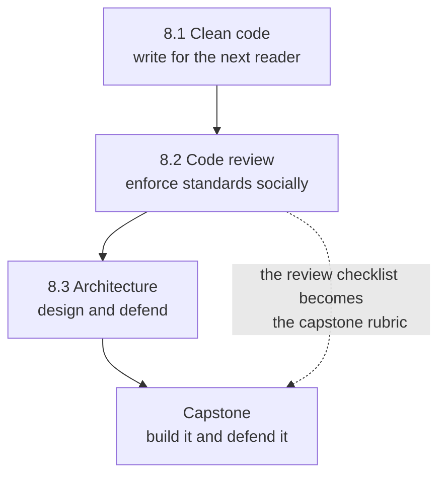

# Part VIII — Professional Automation Engineering

[← Back to Table of Contents](../README.md)

**Level:** 🟡 → 🔴 · **Chapters:** 3 · **Suggested pace:** Weeks 28-29 (3 chapter sessions + capstone kickoff)

---

## Why this part exists

You can build a framework that works. This part is about the difference between a framework that works **today, for you** and one that still works **in two years, for someone you have never met.**

That difference is almost entirely social. Test code is read far more often than it is written — during failures, during onboarding, during incident investigations at 2 a.m. by someone who did not write it. A suite that is technically excellent and unreadable will be abandoned and rewritten, which is the most expensive outcome in automation.

So this part covers three professional competencies that have nothing to do with Playwright:

1. **Writing code other people can change safely** (Chapter 8.1)
2. **Reviewing other people's code usefully and kindly** (Chapter 8.2)
3. **Designing an architecture you can defend under challenge** (Chapter 8.3)

These are also the skills that determine promotion. A junior engineer writes tests. An intermediate engineer writes tests other people can maintain. A senior engineer shapes how the whole team writes tests — through review, standards, and architecture. This part is where that trajectory starts.

---

## Module learning objectives

By the end of Part VIII you will be able to:

1. **Refactor** a test file for naming, function size, single responsibility, duplication, and readability without changing its behavior.
2. **Apply** clean-code principles specifically to test code, and **explain** where test code should differ from application code.
3. **Review** an automation pull request against locator quality, assertions, waiting, duplication, naming, test independence, test data, and error handling.
4. **Write** review comments that are specific, actionable, and prioritized, distinguishing blocking issues from suggestions.
5. **Design** a complete automation architecture for a stated product, team size, and release cadence.
6. **Justify** each architectural layer by the duplication or coupling it removes, and **acknowledge** the trade-offs you accepted.
7. **Defend** a design under challenge, and **revise** it when the challenge is valid.

---

## Chapters in this part

| # | Chapter | Level | Core question |
|---|---|---|---|
| 8.1 | [Clean Code for Automation](01-clean-code-for-automation.md) | 🟡 | Would a stranger understand this test in thirty seconds? |
| 8.2 | [Code Review for Automation Engineers](02-code-review-for-automation.md) | 🔴 | How do I find the real problems in someone's PR, and say so usefully? |
| 8.3 | [Designing a Scalable Automation Architecture](03-scalable-automation-architecture.md) | 🔴 | Given this product and this team, what should the framework look like, and why? |

---

## How the chapters connect

The sequence is deliberate. You cannot review code against standards you have not practiced (8.1 → 8.2), and you cannot design an architecture whose violations you cannot recognize (8.2 → 8.3). The Chapter 8.2 review checklist is then used as-is to grade the capstone, so learners know exactly what they are being measured against.

---

## What "clean" means for test code specifically

Test code is not application code, and some general clean-code advice inverts here. Chapter 8.1 covers this in depth; the summary is worth having early:

| Principle | In application code | In test code |
|---|---|---|
| **DRY (don't repeat yourself)** | Strong priority | Weaker priority. A little duplication in test *bodies* is acceptable when it keeps a test readable in isolation. Duplication in *locators and flows* is not. |
| **Clarity vs cleverness** | Prefer clarity | Prefer clarity even more strongly. A failing test is read under stress. |
| **Abstraction depth** | Layers are normal | Keep the call stack shallow. Three levels of indirection between a test and a click makes failures hard to trace. |
| **Naming** | Descriptive | Descriptive *of behavior and expectation*: `test("rejects checkout when cart is empty")`, not `test("checkout test 3")`. |
| **Comments** | Explain why | Same, plus: any deviation from a course standard (a low-tier locator, a serial block, a retry) requires a one-line justification. |
| **Error handling** | Handle and recover | Usually do *not* recover. A swallowed error in a test is a false pass. Let it fail loudly. |
| **Function length** | Short | Short, and single-purpose. A page object method that logs in *and* navigates *and* asserts is three methods. |

The single test of clean test code: **can a reader tell what broke, and what the expected behavior was, from the test name and the failure message alone?**

---

## The review checklist you will use

Chapter 8.2 builds this out with examples of each. It is also the capstone grading instrument.

| Area | What to look for |
|---|---|
| **Locator quality** | Role/label/text preferred; low-tier locators justified; no `nth-child`, no positional XPath, no unexplained `.first()` |
| **Assertions** | Web-first and auto-retrying; verifying outcomes not actions; would fail if the feature broke; failure message identifies the problem |
| **Waiting** | No `waitForTimeout`; synchronization on named conditions; no `isVisible()` inside an `if` |
| **Duplication** | Repeated flows extracted to page objects or services; repeated setup extracted to fixtures; no copy-pasted locators |
| **Naming** | Test names state expected behavior; page object methods read as user intent; no `data`, `temp`, `helper2` |
| **Test independence** | Passes alone, in any order, in parallel; no reliance on another test's side effects |
| **Test data** | Created by the test, unique, cleaned up in teardown; no hardcoded IDs or shared mutable records |
| **Error handling** | No swallowed failures; custom errors where they aid diagnosis; no `try/catch` used to make a test pass |
| **Architecture** | No locators outside page objects; no assertions inside page objects; no upward dependencies between layers |
| **Configuration** | No hardcoded URLs or credentials; environment-driven; secrets from the credential store |

---

## Prerequisite knowledge for this part

| Required | Where it came from |
|---|---|
| A complete working framework of your own | [Part VI](../part-6-framework-engineering/00-module-overview.md) and Project 4 |
| Layered architecture and abstraction timing | [Chapter 3.2](../part-3-automation-fundamentals/02-test-automation-architecture.md) |
| Locator preference order and synchronization | [Chapters 5.2, 5.5](../part-5-web-automation-playwright/00-module-overview.md) |
| Page objects, fixtures, data factories, configuration | [Chapters 6.1-6.5](../part-6-framework-engineering/00-module-overview.md) |
| Flake diagnosis vocabulary | [Chapter 6.9](../part-6-framework-engineering/09-diagnosing-flaky-tests.md) |
| Pull request workflow and review mechanics | [Chapter 7.1](../part-7-cicd/01-git-for-automation-engineers.md) |

You also need something less tangible: **enough of your own code to be embarrassed by.** Chapter 8.1's most effective exercise is refactoring your Part IV tests, written twelve weeks ago, and noticing what you now see wrong with them.

---

## What you will produce

| Chapter | Artifact |
|---|---|
| 8.1 | A refactor of your own earliest automation code, with a written before/after rationale and proof that behavior is unchanged |
| 8.1 | A one-page team style guide for test code, specific enough to settle real arguments |
| 8.2 | A full written review of a supplied pull request containing ten planted defects, with comments prioritized as blocking, important, or optional |
| 8.2 | A peer review of a classmate's Project 4, and a written response to the review you received |
| 8.3 | An architecture design document for a stated scenario: product, team size, release cadence, existing constraints |
| 8.3 | Your revised [framework constitution](../part-3-automation-fundamentals/00-module-overview.md) from Chapter 3.2, with a changelog explaining what you changed and why |

The revised constitution is the most quietly important artifact in the course. It is direct evidence of learning: the same learner, twenty-five weeks apart, with reasons for every change of mind.

---

## Time budget

| Activity | Hours |
|---|---|
| Sessions (4 × 90 min) | 6.0 |
| Reading | 2.5 |
| Exercises | 3.0 |
| Assignments (refactor, review, architecture) | 9.0 |
| Quizzes and review | 1.5 |
| **Total** | **~22** |

---

## Common misconceptions this part corrects

| Misconception | Reality |
|---|---|
| "Clean code is a style preference." | It is a maintenance cost decision. Unreadable suites get abandoned and rewritten, which is the most expensive outcome available. |
| "Test code doesn't need to be as clean as production code." | Test code *is* production code for the quality process, and it is read under more stress than application code. |
| "DRY applies identically to tests." | Over-DRY tests become unreadable in isolation. Extract flows and locators; tolerate some duplication in test bodies. |
| "Comments are a code smell." | In test code, a one-line justification for a deviation (a serial block, a retry, a CSS locator) is exactly the right use of a comment. |
| "A code review is about finding mistakes." | It is about shared ownership and knowledge transfer. Finding defects is a side effect. |
| "Thorough review means many comments." | Prioritization matters more than volume. Thirty unranked nitpicks hide the one blocking issue. |
| "Reviewing means rewriting it my way." | Style preferences are the reviewer's opinion; standards are the team's agreement. Distinguish them explicitly, every time. |
| "Architecture means more layers and patterns." | Architecture means the *minimum* structure that makes the expected change cheap. Every layer must earn its place. |
| "There is one correct framework design." | Design depends on product, team size, release cadence, and existing skills. The skill is fitting the context and saying why. |
| "Defending a design means never changing it." | Defending means having reasons. Changing your mind for a good reason is the strongest possible outcome of a design review. |

---

## Gate before the capstone

You are ready for the capstone when:

- You can review an unfamiliar automation PR and produce prioritized, specific, actionable comments
- You can refactor a test file with no behavior change and explain every edit
- You can design an architecture for a described team and justify each layer by the cost it removes
- You can state at least two trade-offs you deliberately accepted in your own framework, and what would make you revisit them
- Your framework constitution reflects what you actually believe now, not what you copied in Week 11

---

## What comes next

The [capstone project](../capstone/00-capstone-overview.md): a complete API and UI automation framework for the demo e-commerce application, running in parallel across browsers, in Docker, driven by a Jenkins pipeline that publishes reports, screenshots, and traces — plus a live architecture defense where you explain and, where warranted, revise your decisions.

→ [Instructor Notes for Part VIII](instructor-notes.md)
→ [Chapter 8.1 — Clean Code for Automation](01-clean-code-for-automation.md)
