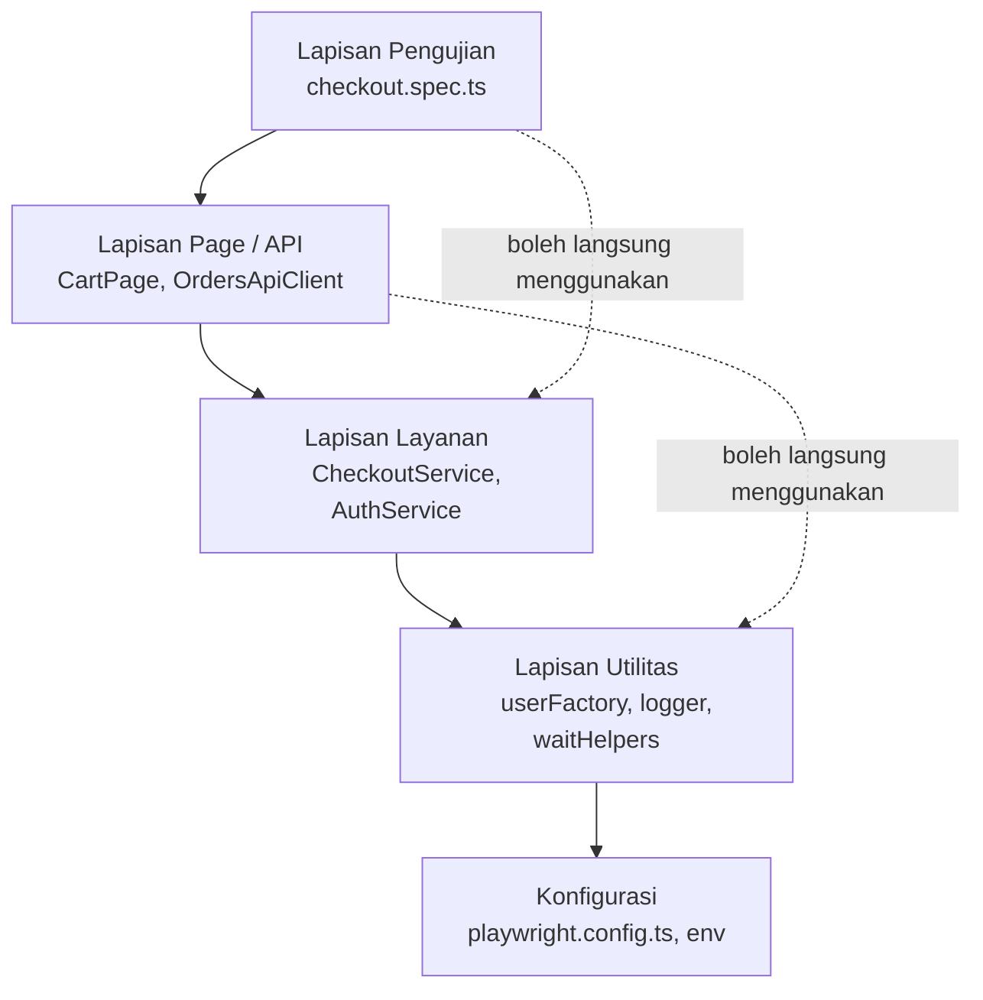
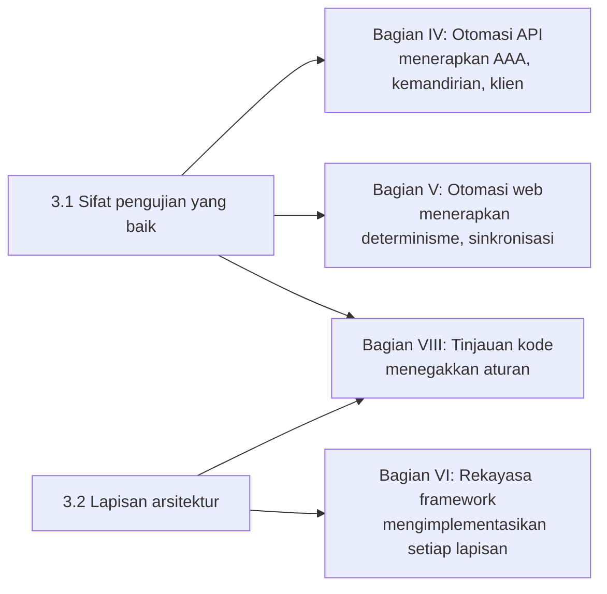

# Bagian III — Dasar-Dasar Otomasi Pengujian

[← Kembali ke Daftar Isi](../README.md)

**Tingkat:** 🟡 Menengah · **Bab:** 2 · **Kecepatan yang disarankan:** Minggu 11 (2 sesi)

---

## Mengapa bagian ini ada

Anda sudah bisa menulis TypeScript. Anda bisa membuka Playwright hari ini dan menghasilkan sesuatu yang bisa berjalan.

Itulah saat yang tepat untuk berhenti dan mengajukan pertanyaan yang berbeda: **apa yang membuat sebuah pengujian otomatis layak dimiliki?**

Setiap tim memiliki rangkaian pengujian yang tidak mereka percaya. Gejalanya selalu sama — pengujian yang lulus setelah dijalankan ulang, pengujian yang harus dijalankan dalam urutan tertentu, pengujian yang gagal pada hari Selasa karena seseorang mengubah data di lingkungan bersama, pengujian yang pesan kegagalannya tidak memberi tahu apa pun kecuali bahwa sesuatu telah terjadi. Tidak ada yang berniat membangun hal itu. Semuanya menumpuk, satu jalan pintas yang terlihat masuk akal dalam satu waktu.

Bagian ini singkat dan hampir tidak mengandung kode. Tujuannya adalah memberi Anda kosakata dan standar yang akan Anda terapkan selama 21 minggu ke depan: kemandirian, isolasi, determinisme, Arrange-Act-Assert, dan arsitektur berlapis yang membuat rangkaian pengujian yang terus berkembang tetap dapat dipahami.

Setiap argumen desain di Bagian IV hingga VIII kembali mengacu pada dua bab ini.

---

## Tujuan pembelajaran modul

Di akhir Bagian III, Anda akan mampu:

1. **Mendefinisikan** sifat-sifat pengujian otomatis yang dapat dipercaya: kemandirian, isolasi, determinisme, dan kejelasan niat.
2. **Mengevaluasi** pengujian yang ada terhadap sifat-sifat tersebut dan **mengidentifikasi** mana yang dilanggar.
3. **Merestrukturisasi** pengujian menjadi fase Arrange → Act → Assert yang eksplisit.
4. **Memilih** antara setup/teardown bersama dan pembuatan data per-pengujian untuk skenario tertentu, dan **membenarkan** pilihan tersebut.
5. **Menjelaskan** tanggung jawab setiap lapisan dalam arsitektur otomasi berlapis.
6. **Menempatkan** sebuah kode yang diusulkan ke lapisan yang tepat, dan **mengenali** pelanggaran lapisan dalam tinjauan kode.
7. **Menggambarkan** peran test runner, assertion library, reporter, log, dan artefak selama investigasi kegagalan.
8. **Membedakan** penggunaan kembali dari abstraksi yang prematur, dan **berargumen** kapan duplikasi adalah pilihan yang lebih baik.

---

## Bab-bab dalam bagian ini

| # | Bab | Tingkat | Pertanyaan inti |
|---|---|---|---|
| 3.1 | [Prinsip-Prinsip Pengujian Otomatis yang Baik](01-principles-of-good-automated-tests.md) | 🟡 | Apa yang membuat satu pengujian dapat dipercaya, dan apa yang diam-diam menghancurkan kepercayaan? |
| 3.2 | [Arsitektur Otomasi Pengujian](02-test-automation-architecture.md) | 🟡 | Bagaimana Anda mengorganisasi 500 pengujian agar orang asing pun masih bisa menemukan arah? |

---

## Arsitektur yang sedang Anda tuju

Bab 3.2 memperkenalkan pelapisan yang diimplementasikan oleh sisa kursus. Pelajari nama-namanya sekarang; Anda akan membangun setiap lapisan secara berurutan.

```text
Lapisan Pengujian     Apa yang sedang diverifikasi, dalam bahasa bisnis
    ↓
Lapisan Page/API      Cara berinteraksi dengan satu layar atau satu endpoint
    ↓
Lapisan Layanan       Alur kerja bisnis multi-langkah (daftar, lalu masuk, lalu isi keranjang)
    ↓
Lapisan Utilitas      Pembantu generik: data factories, pemformatan tanggal, percobaan ulang, logging
    ↓
Konfigurasi           Lingkungan, URL dasar, kredensial, batas waktu, browser
```

Satu aturan yang membuat ini berguna: **setiap lapisan boleh bergantung pada lapisan di bawahnya, tidak pernah yang di atasnya.** Sebuah page object tidak boleh mengetahui pengujian mana yang menggunakannya. Sebuah utilitas tidak boleh mengetahui tentang halaman login Anda.



Garis putus-putus adalah jalan pintas yang sah. Panah yang menunjuk ke atas adalah pelanggaran arsitektur, dan Bab 8.2 mengajarkan Anda untuk menangkapnya dalam tinjauan kode.

---

## Bagaimana bagian ini terhubung dengan sisa kursus



Bagian III adalah tempat Anda mempelajari standar. Bagian IV-VI adalah tempat Anda mengimplementasikannya. Bagian VIII adalah tempat Anda belajar menegakkannya pada kode orang lain.

---

## Pengetahuan prasyarat untuk bagian ini

| Diperlukan | Sumbernya |
|---|---|
| Kosakata jenis dan strategi pengujian | [Bagian I](../part-1-testing-fundamentals/00-module-overview.md) |
| Fungsi, array, objek, antarmuka | [Bab 2.7-2.10](../part-2-programming-fundamentals/00-module-overview.md) |
| Async/await dan Promises | [Bab 2.12](../part-2-programming-fundamentals/12-asynchronous-programming.md) |
| Pengalaman duplikasi dalam kode Anda sendiri | Proyek 1 dan 2 |

Proyek 1 dan 2 penting di sini lebih dari yang terlihat. Ketika Bab 3.2 berargumen untuk lapisan utilitas, Anda akan mengenali argumennya, karena Anda sudah menyalin perhitungan pass-rate yang sama ke tiga file.

---

## Apa yang akan Anda hasilkan

| Bab | Artefak |
|---|---|
| 3.1 | Audit tertulis dari lima pengujian yang disediakan, menyebutkan sifat yang dilanggar di setiap pengujian dan mengusulkan perbaikan |
| 3.1 | Penulisan ulang pengujian yang kusut menjadi fase Arrange → Act → Assert yang bersih |
| 3.2 | Diagram lapisan untuk aplikasi e-commerce demo, dengan setiap file yang direncanakan ditetapkan ke sebuah lapisan |
| 3.2 | Satu halaman "konstitusi framework": aturan Anda tentang apa yang boleh ada di mana, untuk ditegakkan pada capstone Anda sendiri |

Konstitusi framework bukan pekerjaan sia-sia. Anda akan dinilai berdasarkan dokumen Anda sendiri dalam pembelaan arsitektur capstone, dan Anda boleh merevisinya — selama Anda bisa menjelaskan apa yang mengubah pikiran Anda.

---

## Anggaran waktu

| Aktivitas | Jam |
|---|---|
| Sesi (2 × 90 menit) | 3,0 |
| Membaca | 1,5 |
| Latihan | 1,5 |
| Tugas | 2,5 |
| Kuis | 0,5 |
| **Total** | **~9** |

---

## Kesalahpahaman umum yang dikoreksi bagian ini

| Kesalahpahaman | Kenyataan |
|---|---|
| "Pengujian yang lulus adalah pengujian yang baik." | Pengujian yang tidak bisa gagal tidak ada nilainya. Pengujian yang gagal karena alasan yang salah justru merugikan. |
| "Pengujian bisa berbagi data asalkan saya hati-hati." | "Hati-hati" tidak bertahan terhadap eksekusi paralel, percobaan ulang, atau kolega yang menambahkan pengujian bulan depan. |
| "Ketergantungan urutan pengujian tidak apa-apa, saya mengontrol urutannya." | Saat Anda mengaktifkan paralelisme (Bab 6.7) atau menjalankan satu pengujian secara terisolasi untuk debug, ketergantungan urutan menjadi gangguan. |
| "Determinisme berarti tidak ada keacakan." | Determinisme berarti *vonis* stabil. Data yang *acak* sering kali merupakan cara untuk mencapainya, karena data unik menghilangkan tabrakan. |
| "Setup dan teardown seharusnya berada di `beforeAll` untuk kecepatan." | Kecepatan yang dibeli dengan state mutable yang dibagi akan dibayar kembali dengan kegagalan yang tidak dapat dipercaya. |
| "Lebih banyak lapisan berarti arsitektur yang lebih baik." | Lapisan memiliki biaya arah tidak langsung. Setiap lapisan harus membuktikan nilainya dengan menghilangkan duplikasi nyata atau penggabungan nyata. |
| "Penggunaan kembali selalu baik." | Abstraksi prematur lebih sulit dibatalkan daripada duplikasi. Bab 3.2 memberikan aturan praktisnya: abstraksi pada kemunculan ketiga, bukan yang pertama. |
| "Log dan laporan untuk manajer." | Keduanya adalah instrumen diagnostik utama Anda. Kegagalan yang tidak dapat Anda diagnosis dari artefak akan menghabiskan waktu Anda untuk menjalankan ulang setiap kali. |

---

## Gerbang sebelum melanjutkan

Jangan mulai Bagian IV sampai Anda bisa melakukan ini:

> Diberikan sebuah file pengujian yang belum pernah Anda lihat, identifikasi (a) sifat keandalan mana yang dilanggar setiap pengujian, jika ada, (b) di mana fase Arrange, Act, dan Assert-nya, dan (c) lapisan mana yang dimiliki setiap bagian kodenya.

Itulah persis keterampilan tinjauan yang Anda butuhkan ketika Bab 4.7 meminta Anda untuk memperbaiki kode permintaan yang terduplikasi menjadi klien API, dan sekali lagi ketika Bab 6.1 meminta Anda untuk mengekstrak page objects.

---

## Apa yang akan datang berikutnya

Bagian IV membawa prinsip-prinsip ini ke dalam praktik pada antarmuka nyata paling sederhana yang tersedia: API HTTP. Tidak ada rendering, tidak ada locator, tidak ada timing — hanya permintaan, respons, dan disiplin yang baru saja Anda pelajari.

→ [Catatan Instruktur untuk Bagian III](instructor-notes.md)
→ [Bab 3.1 — Prinsip-Prinsip Pengujian Otomatis yang Baik](01-principles-of-good-automated-tests.md)
